Autocalibration, application on real data (Poisson)
================
Arthur Charpentier, Michel Denuit & Julien Trufin
05/03/2021

This github repository is based on the paper

Michel Denuit, Arthur Charpentier & Julien Trufin (2021)
**Autocalibration and Tweedie-dominance for Insurance Pricing with
Machine Learning** [https://arxiv.org/abs/2103.03635](ArXiv:2103.03635)

Here are the codes used to produce the figures in section 6.

# Dataset and other parameters

First, let us define a color palette for graphs

``` r
library("wesanderson")
library(scales)
clrpal = wes_palette("Zissou1", 22, type = "continuous")
clrpallow = scales::alpha(clrpal,.4)
bleurouge = clrpal[c(1,22)]
bleurougepal = clrpallow[c(1,22)]
clrpal4 = colr =  wes_palette("Darjeeling1")[c(1,2,3,5)]
clrpal6 = wes_palette("Zissou1", 6, type = "continuous")
```

The dataset we will use is `freMTPL2freq` from the `CASdatasets` package
(see <http://cas.uqam.ca>),

``` r
library(CASdatasets)
data(freMTPL2freq)
str(freMTPL2freq)
```

    ## 'data.frame':    678013 obs. of  12 variables:
    ##  $ IDpol     : num  1 3 5 10 11 13 15 17 18 21 ...
    ##  $ ClaimNb   : 'table' num [1:678013(1d)] 1 1 1 1 1 1 1 1 1 1 ...
    ##  $ Exposure  : num  0.1 0.77 0.75 0.09 0.84 0.52 0.45 0.27 0.71 0.15 ...
    ##  $ VehPower  : int  5 5 6 7 7 6 6 7 7 7 ...
    ##  $ VehAge    : int  0 0 2 0 0 2 2 0 0 0 ...
    ##  $ DrivAge   : int  55 55 52 46 46 38 38 33 33 41 ...
    ##  $ BonusMalus: int  50 50 50 50 50 50 50 68 68 50 ...
    ##  $ VehBrand  : Factor w/ 11 levels "B1","B10","B11",..: 4 4 4 4 4 4 4 4 4 4 ...
    ##  $ VehGas    : chr  "Regular" "Regular" "Diesel" "Diesel" ...
    ##  $ Area      : Factor w/ 6 levels "A","B","C","D",..: 4 4 2 2 2 5 5 3 3 2 ...
    ##  $ Density   : int  1217 1217 54 76 76 3003 3003 137 137 60 ...
    ##  $ Region    : Factor w/ 21 levels "Alsace","Aquitaine",..: 21 21 18 2 2 16 16 13 13 17 ...

For the *boosting* algorithm, we will use the `h2o` package

``` r
library(h2o)
#h2o.shutdown(prompt = TRUE)
h2o.init(nthreads = -1)
```

    ## 
    ## H2O is not running yet, starting it now...
    ## 
    ## Note:  In case of errors look at the following log files:
    ##     /var/folders/jw/bsvzb1nn7577pv7mkz9ny91c7jg7gx/T//RtmpstShW6/file9311e16ad36/h2o_acharpen_started_from_r.out
    ##     /var/folders/jw/bsvzb1nn7577pv7mkz9ny91c7jg7gx/T//RtmpstShW6/file93162c5c3a8/h2o_acharpen_started_from_r.err
    ## 
    ## 
    ## Starting H2O JVM and connecting: ...... Connection successful!
    ## 
    ## R is connected to the H2O cluster: 
    ##     H2O cluster uptime:         4 seconds 331 milliseconds 
    ##     H2O cluster timezone:       America/Toronto 
    ##     H2O data parsing timezone:  UTC 
    ##     H2O cluster version:        3.32.0.3 
    ##     H2O cluster version age:    5 months and 27 days !!! 
    ##     H2O cluster name:           H2O_started_from_R_acharpen_sso215 
    ##     H2O cluster total nodes:    1 
    ##     H2O cluster total memory:   4.00 GB 
    ##     H2O cluster total cores:    4 
    ##     H2O cluster allowed cores:  4 
    ##     H2O cluster healthy:        TRUE 
    ##     H2O Connection ip:          localhost 
    ##     H2O Connection port:        54321 
    ##     H2O Connection proxy:       NA 
    ##     H2O Internal Security:      FALSE 
    ##     H2O API Extensions:         Amazon S3, XGBoost, Algos, AutoML, Core V3, TargetEncoder, Core V4 
    ##     R Version:                  R version 3.6.3 (2020-02-29)

    ## Warning in h2o.clusterInfo(): 
    ## Your H2O cluster version is too old (5 months and 27 days)!
    ## Please download and install the latest version from http://h2o.ai/download/

``` r
h2o.no_progress()
```

In that package, inputs are matrices, so we have to expand factor
variables into indicators (using
`model.matrix`),

``` r
LM = model.matrix(ClaimNb ~ VehPower+VehAge+DrivAge+BonusMalus+VehBrand+Area+Density+Region+VehGas+Exposure, data=freMTPL2freq)
LM = cbind(ClaimNb=freMTPL2freq$ClaimNb,LM)
LM = as.data.frame(LM)
```

We create three subsets

  - a training dataset, `train_LM` (or `train_LM_h2o` to consider
    categorical variables as a collection of indicators), here with 60%
    of the observations
  - a validation dataset, `valid_LM` (or `validation_LM_h2o` to consider
    categorical variables as a collection of indicators), here with 20%
    of the observations, used for the model bias correction
  - a final dataset, `final_LM` (or `final_LM_h2o` to consider
    categorical variables as a collection of indicators), here with 20%
    of the observations, for tests

<!-- end list -->

``` r
set.seed(123)
TAUX = c(.6,.2)
idx_train = sample(1:nrow(LM),size = round(nrow(LM)*TAUX[1]))
idx_reste = (1:nrow(LM))[-idx_train]
idx_correct = sample(idx_reste,size = round(nrow(LM)*TAUX[2]))
idx_final = (1:nrow(LM))[-c(idx_train,idx_correct)]
train_LM_h2o = as.h2o(LM[idx_train,])
valid_LM_h2o = as.h2o(LM[idx_correct,])
final_LM_h2o = as.h2o(LM[idx_final,])
train_LM = freMTPL2freq[idx_train,]
valid_LM = freMTPL2freq[idx_correct,]
final_LM = freMTPL2freq[idx_final,]
valid_LM_1 = valid_LM 
valid_LM_1$Exposure =1
valid_LM_h2o_1 = valid_LM_h2o
valid_LM_h2o_1$Exposure =1
final_LM_1 = final_LM 
final_LM_1$Exposure =1
final_LM_h2o_1 = final_LM_h2o
final_LM_h2o_1$Exposure =1
```

On the validation and testing datasets, a copy is created with a unit
exposure (variable `Exposure`).

# Models (GLM, GAM, Boosting and Neural Nets)

## Learning on the *training* datasets

We create three linear models

  - `reg0` which is a Poisson regression on the intercept, only (to have
    a benchmark)
  - `reg_glm` which is a Poisson regression
  - `reg_0_gam` which is a Poisson regression with smooth (splines)
    transformation of continuous covariates

<!-- end list -->

``` r
library(splines)
reg0 = glm(ClaimNb~1+offset(log(Exposure)),family=poisson,data=train_LM)
reg_glm = glm(ClaimNb~VehPower+VehAge+DrivAge+BonusMalus+Density+VehBrand+VehGas+Area+Region+offset(log(Exposure)),family=poisson,data=train_LM)
reg_gam = glm(ClaimNb~bs(VehPower)+bs(VehAge)+bs(DrivAge)+bs(BonusMalus)+bs(Density)+VehBrand+VehGas+Area+Region+offset(log(Exposure)),family=poisson,data=train_LM)
```

The we run two boosting algorithms, one with 30 trees, and one with 1000
trees

``` r
reg_bst_30 = h2o.gbm(y = "ClaimNb", x = names(LM)[3:43],
                       distribution = "poisson",
                       offset_column = "Exposure",
                       training_frame = train_LM_h2o,
                       validation_frame = valid_LM_h2o,
                       ntrees = 30,
                       nfolds = 5,
                       seed = 1)
reg_bst_1000 = h2o.gbm(y = "ClaimNb", x = names(LM)[3:43],
                       distribution = "poisson",
                       offset_column = "Exposure",
                       training_frame = train_LM_h2o,
                       validation_frame = valid_LM_h2o,
                       ntrees = 1000,
                       nfolds = 5,
                       seed = 1)
reg_bst = reg_bst_30
```

Here is the cross-validation loss

``` r
plot(reg_bst_1000)
```

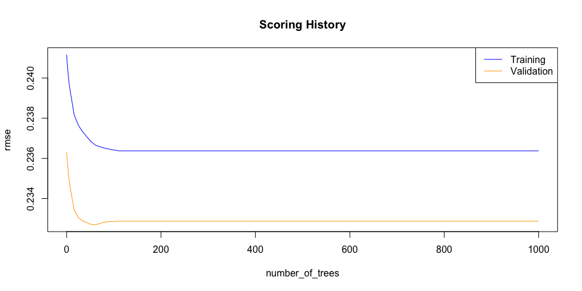<!-- -->

For neural nets, we use the strategy discussed in
<https://www.kaggle.com/floser/glm-neural-nets-and-xgboost-for-insurance-pricing#4.-Machine-learning-improved-GLMs>,
i.e. combined actuarial neural net (CANN) from
[https://papers.ssrn.com/sol3/papers.cfm?abstract\_id=3320525](Schelldorfer%20and%20Wüthrich%20\(2019\))

``` r
library(keras)
library(data.table)
```

    ## 
    ## Attaching package: 'data.table'

    ## The following objects are masked from 'package:h2o':
    ## 
    ##     hour, month, week, year

    ## The following objects are masked from 'package:xts':
    ## 
    ##     first, last

``` r
dat = freMTPL2freq
dat$VehGas <- factor(dat$VehGas)      # consider VehGas as categorical
dat$ClaimNb <- pmin(dat$ClaimNb, 4)   # correct for unreasonable observations (that might be data error)
dat$Exposure <- pmin(dat$Exposure, 1) # correct for unreasonable observations (that might be data error)

Poisson.Deviance <- function(pred, obs){200*(sum(pred)-sum(obs)+sum(log((obs/pred)^(obs))))/length(pred)}
```

``` r
###############################################
#########  feature pre-processing for GLM
###############################################

dat2 <- dat
dat2$AreaGLM <- as.integer(dat2$Area)
dat2$VehPowerGLM <- as.factor(pmin(dat2$VehPower,9))
VehAgeGLM <- cbind(c(0:110), c(1, rep(2,10), rep(3,100)))
dat2$VehAgeGLM <- as.factor(VehAgeGLM[dat2$VehAge+1,2])
dat2[,"VehAgeGLM"] <-relevel(dat2[,"VehAgeGLM"], ref="2")
DrivAgeGLM <- cbind(c(18:100), c(rep(1,21-18), rep(2,26-21), rep(3,31-26), rep(4,41-31), rep(5,51-41), rep(6,71-51), rep(7,101-71)))
dat2$DrivAgeGLM <- as.factor(DrivAgeGLM[dat2$DrivAge-17,2])
dat2[,"DrivAgeGLM"] <-relevel(dat2[,"DrivAgeGLM"], ref="5")
dat2$BonusMalusGLM <- as.integer(pmin(dat2$BonusMalus, 150))
dat2$DensityGLM <- as.numeric(log(dat2$Density))
# dat2[,"Region"] <-relevel(dat2[,"Region"], ref="R24")

###############################################
#########  choosing learning and test sample
###############################################
```

``` r
learn <- dat2[idx_train,]
test <- dat2[idx_correct,]
valid <- dat2[idx_final,] 
(n_l <- nrow(learn))
```

    ## [1] 406808

``` r
(n_t <- nrow(test))
```

    ## [1] 135603

``` r
sum(learn$ClaimNb)/sum(learn$Exposure)
```

    ## [1] 0.1012017

``` r
###############################################
#########  GLM2 analysis
###############################################

{t1 <- proc.time()
d.glm2 <- glm(ClaimNb ~ VehPowerGLM + VehAgeGLM + BonusMalusGLM
              + VehBrand + VehGas + DensityGLM + Region + AreaGLM +
                DrivAge + log(DrivAge) +  I(DrivAge^2) + I(DrivAge^3) + I(DrivAge^4), 
              data=learn, offset=log(Exposure), family=poisson())
(proc.time()-t1)}
```

    ##    user  system elapsed 
    ##  12.003   1.630  14.021

``` r
summary(d.glm2)
```

    ## 
    ## Call:
    ## glm(formula = ClaimNb ~ VehPowerGLM + VehAgeGLM + BonusMalusGLM + 
    ##     VehBrand + VehGas + DensityGLM + Region + AreaGLM + DrivAge + 
    ##     log(DrivAge) + I(DrivAge^2) + I(DrivAge^3) + I(DrivAge^4), 
    ##     family = poisson(), data = learn, offset = log(Exposure))
    ## 
    ## Deviance Residuals: 
    ##     Min       1Q   Median       3Q      Max  
    ## -1.9821  -0.3793  -0.2897  -0.1634   6.8547  
    ## 
    ## Coefficients:
    ##                                     Estimate Std. Error z value Pr(>|z|)    
    ## (Intercept)                        6.366e+01  6.242e+00  10.198  < 2e-16 ***
    ## VehPowerGLM5                       1.469e-01  2.341e-02   6.276 3.48e-10 ***
    ## VehPowerGLM6                       2.039e-01  2.318e-02   8.794  < 2e-16 ***
    ## VehPowerGLM7                       1.169e-01  2.298e-02   5.086 3.65e-07 ***
    ## VehPowerGLM8                      -1.084e-01  3.494e-02  -3.104  0.00191 ** 
    ## VehPowerGLM9                       1.849e-01  2.568e-02   7.202 5.93e-13 ***
    ## VehAgeGLM1                         1.162e+00  2.106e-02  55.147  < 2e-16 ***
    ## VehAgeGLM3                        -2.071e-01  1.719e-02 -12.047  < 2e-16 ***
    ## BonusMalusGLM                      2.358e-02  4.355e-04  54.147  < 2e-16 ***
    ## VehBrandB10                        5.112e-02  4.699e-02   1.088  0.27669    
    ## VehBrandB11                        7.282e-02  5.178e-02   1.406  0.15966    
    ## VehBrandB12                        1.374e-01  2.266e-02   6.063 1.33e-09 ***
    ## VehBrandB13                        2.509e-02  5.357e-02   0.468  0.63952    
    ## VehBrandB14                       -1.030e-01  9.933e-02  -1.037  0.29971    
    ## VehBrandB2                         9.607e-03  1.977e-02   0.486  0.62698    
    ## VehBrandB3                         2.160e-02  2.810e-02   0.769  0.44205    
    ## VehBrandB4                        -3.996e-02  3.905e-02  -1.023  0.30616    
    ## VehBrandB5                         9.931e-02  3.193e-02   3.110  0.00187 ** 
    ## VehBrandB6                         1.288e-02  3.667e-02   0.351  0.72552    
    ## VehGasRegular                      6.132e-02  1.468e-02   4.179 2.93e-05 ***
    ## DensityGLM                         2.345e-02  1.549e-02   1.515  0.12987    
    ## RegionAquitaine                   -1.368e-01  1.149e-01  -1.190  0.23399    
    ## RegionAuvergne                    -3.272e-01  1.446e-01  -2.263  0.02365 *  
    ## RegionBasse-Normandie              4.324e-03  1.208e-01   0.036  0.97145    
    ## RegionBourgogne                   -9.088e-03  1.233e-01  -0.074  0.94124    
    ## RegionBretagne                     8.645e-02  1.121e-01   0.771  0.44067    
    ## RegionCentre                       6.687e-02  1.104e-01   0.605  0.54486    
    ## RegionChampagne-Ardenne           -1.272e-02  1.542e-01  -0.082  0.93426    
    ## RegionCorse                        1.121e-01  1.370e-01   0.818  0.41329    
    ## RegionFranche-Comte               -3.176e-01  2.184e-01  -1.454  0.14585    
    ## RegionHaute-Normandie             -9.245e-02  1.320e-01  -0.700  0.48369    
    ## RegionIle-de-France               -7.744e-02  1.114e-01  -0.695  0.48687    
    ## RegionLanguedoc-Roussillon        -6.410e-02  1.142e-01  -0.561  0.57448    
    ## RegionLimousin                     1.763e-01  1.362e-01   1.294  0.19554    
    ## RegionMidi-Pyrenees               -1.231e-01  1.197e-01  -1.028  0.30378    
    ## RegionNord-Pas-de-Calais          -1.708e-01  1.134e-01  -1.506  0.13201    
    ## RegionPays-de-la-Loire             2.699e-03  1.129e-01   0.024  0.98093    
    ## RegionPicardie                     1.111e-01  1.246e-01   0.892  0.37260    
    ## RegionPoitou-Charentes            -5.713e-02  1.170e-01  -0.488  0.62541    
    ## RegionProvence-Alpes-Cotes-D'Azur -2.572e-02  1.111e-01  -0.232  0.81683    
    ## RegionRhone-Alpes                  6.256e-02  1.107e-01   0.565  0.57199    
    ## AreaGLM                            3.003e-02  2.079e-02   1.445  0.14854    
    ## DrivAge                            3.203e+00  3.470e-01   9.230  < 2e-16 ***
    ## log(DrivAge)                      -3.882e+01  3.762e+00 -10.319  < 2e-16 ***
    ## I(DrivAge^2)                      -4.547e-02  5.667e-03  -8.023 1.03e-15 ***
    ## I(DrivAge^3)                       3.568e-04  5.206e-05   6.853 7.21e-12 ***
    ## I(DrivAge^4)                      -1.111e-06  1.925e-07  -5.769 7.98e-09 ***
    ## ---
    ## Signif. codes:  0 '***' 0.001 '**' 0.01 '*' 0.05 '.' 0.1 ' ' 1
    ## 
    ## (Dispersion parameter for poisson family taken to be 1)
    ## 
    ##     Null deviance: 134905  on 406807  degrees of freedom
    ## Residual deviance: 128011  on 406761  degrees of freedom
    ## AIC: 169943
    ## 
    ## Number of Fisher Scoring iterations: 6

``` r
learn$fitGLM2 <- fitted(d.glm2)
test$fitGLM2 <- predict(d.glm2, newdata=test, type="response")
dat$fitGLM2 <- predict(d.glm2, newdata=dat2, type="response")

# in-sample and out-of-sample losses (in 10^(-2))
Poisson.Deviance(learn$fitGLM2, learn$ClaimNb)
```

    ## [1] 31.46722

``` r
Poisson.Deviance(test$fitGLM2, test$ClaimNb)
```

    ## [1] 31.20646

``` r
round(sum(test$fitGLM2)/sum(test$Exposure),4)
```

    ## [1] 0.1011

``` r
PreProcess.Continuous <- function(var1, dat2){
  names(dat2)[names(dat2) == var1]  <- "V1"
  dat2$X <- as.numeric(dat2$V1)
  dat2$X <- 2*(dat2$X-min(dat2$X))/(max(dat2$X)-min(dat2$X))-1
  names(dat2)[names(dat2) == "V1"]  <- var1
  names(dat2)[names(dat2) == "X"]  <- paste(var1,"X", sep="")
  dat2
}
```

``` r
Features.PreProcess <- function(dat2){
  dat2 <- PreProcess.Continuous("Area", dat2)   
  dat2 <- PreProcess.Continuous("VehPower", dat2)   
  dat2$VehAge <- pmin(dat2$VehAge,20)
  dat2 <- PreProcess.Continuous("VehAge", dat2)   
  dat2$DrivAge <- pmin(dat2$DrivAge,90)
  dat2 <- PreProcess.Continuous("DrivAge", dat2)   
  dat2$BonusMalus <- pmin(dat2$BonusMalus,150)
  dat2 <- PreProcess.Continuous("BonusMalus", dat2)   
  dat2$VehBrandX <- as.integer(dat2$VehBrand)-1
  dat2$VehGasX <- as.integer(dat2$VehGas)-1.5
  dat2$Density <- round(log(dat2$Density),2)
  dat2 <- PreProcess.Continuous("Density", dat2)   
  dat2$RegionX <- as.integer(dat2$Region)-1
  dat2
}
```

``` r
dat2 <- Features.PreProcess(dat)     

learn <- dat2[idx_train,]
test <- dat2[idx_correct,]
valid <- dat2[idx_final,]
```

``` r
(n_l <- nrow(learn))
```

    ## [1] 406808

``` r
(n_t <- nrow(test))
```

    ## [1] 135603

``` r
(n_f <- nrow(valid))
```

    ## [1] 135602

``` r
learn0 <- learn
test0 <- test
valid0 <- valid

features <- c(14:18, 20:21)
(q0 <- length(features))
```

    ## [1] 7

``` r
Xlearn <- as.matrix(learn[, features])  # design matrix learning sample
Brlearn <- as.matrix(learn$VehBrandX)
Relearn <- as.matrix(learn$RegionX)
Ylearn <- as.matrix(learn$ClaimNb)
# testing data
Xtest <- as.matrix(test[, features])    # design matrix test sample
Brtest <- as.matrix(test$VehBrandX)
Retest <- as.matrix(test$RegionX)
Ytest <- as.matrix(test$ClaimNb)

Xvalid <- as.matrix(valid[, features])    # design matrix test sample
Brvalid <- as.matrix(valid$VehBrandX)
Revalid <- as.matrix(valid$RegionX)
Yvalid <- as.matrix(valid$ClaimNb)
# choosing the right volumes for EmbNN and CANN
Vlearn <- as.matrix(log(learn$Exposure))
Vtest <- as.matrix(log(test$Exposure))
Vvalid <- as.matrix(log(valid$Exposure))
lambda.hom <- sum(learn$ClaimNb)/sum(learn$Exposure)
```

``` r
CANN <- 1  # 0=Embedding NN, 1=CANN
```

``` r
if (CANN==1){
  Vlearn <- as.matrix(log(learn$fitGLM2))
  Vtest <- as.matrix(log(test$fitGLM2))
  Vvalid <- as.matrix(log(valid$fitGLM2))
  lambda.hom <- sum(learn$ClaimNb)/sum(learn$fitGLM2)
}
lambda.hom
```

    ## [1] 1

``` r
(BrLabel <- length(unique(learn$VehBrandX)))
```

    ## [1] 11

``` r
(ReLabel <- length(unique(learn$RegionX)))
```

    ## [1] 21

``` r
q1 <- 20   
q2 <- 15
q3 <- 10
d <- 2     

Design   <- layer_input(shape = c(q0),  dtype = 'float32', name = 'Design')
VehBrand <- layer_input(shape = c(1),   dtype = 'int32', name = 'VehBrand')
Region   <- layer_input(shape = c(1),   dtype = 'int32', name = 'Region')
LogVol   <- layer_input(shape = c(1),   dtype = 'float32', name = 'LogVol')
```

``` r
BrandEmb = VehBrand %>% 
  layer_embedding(input_dim = BrLabel, output_dim = d, input_length = 1, name = 'BrandEmb') %>%
  layer_flatten(name='Brand_flat')

RegionEmb = Region %>% 
  layer_embedding(input_dim = ReLabel, output_dim = d, input_length = 1, name = 'RegionEmb') %>%
  layer_flatten(name='Region_flat')

Network = list(Design, BrandEmb, RegionEmb) %>% layer_concatenate(name='concate') %>% 
  layer_dense(units=q1, activation='tanh', name='hidden1') %>%
  layer_dense(units=q2, activation='tanh', name='hidden2') %>%
  layer_dense(units=q3, activation='tanh', name='hidden3') %>%
  layer_dense(units=1, activation='linear', name='Network', 
              weights=list(array(0, dim=c(q3,1)), array(log(lambda.hom), dim=c(1))))

Response = list(Network, LogVol) %>% layer_add(name='Add') %>% 
  layer_dense(units=1, activation=k_exp, name = 'Response', trainable=FALSE,
              weights=list(array(1, dim=c(1,1)), array(0, dim=c(1))))

model <- keras_model(inputs = c(Design, VehBrand, Region, LogVol), outputs = c(Response))
model %>% compile(optimizer = optimizer_nadam(), loss = 'poisson')
summary(model)
```

    ## Model: "model"
    ## ________________________________________________________________________________
    ## Layer (type)              Output Shape      Param #  Connected to               
    ## ================================================================================
    ## VehBrand (InputLayer)     [(None, 1)]       0                                   
    ## ________________________________________________________________________________
    ## Region (InputLayer)       [(None, 1)]       0                                   
    ## ________________________________________________________________________________
    ## BrandEmb (Embedding)      (None, 1, 2)      22       VehBrand[0][0]             
    ## ________________________________________________________________________________
    ## RegionEmb (Embedding)     (None, 1, 2)      42       Region[0][0]               
    ## ________________________________________________________________________________
    ## Design (InputLayer)       [(None, 7)]       0                                   
    ## ________________________________________________________________________________
    ## Brand_flat (Flatten)      (None, 2)         0        BrandEmb[0][0]             
    ## ________________________________________________________________________________
    ## Region_flat (Flatten)     (None, 2)         0        RegionEmb[0][0]            
    ## ________________________________________________________________________________
    ## concate (Concatenate)     (None, 11)        0        Design[0][0]               
    ##                                                      Brand_flat[0][0]           
    ##                                                      Region_flat[0][0]          
    ## ________________________________________________________________________________
    ## hidden1 (Dense)           (None, 20)        240      concate[0][0]              
    ## ________________________________________________________________________________
    ## hidden2 (Dense)           (None, 15)        315      hidden1[0][0]              
    ## ________________________________________________________________________________
    ## hidden3 (Dense)           (None, 10)        160      hidden2[0][0]              
    ## ________________________________________________________________________________
    ## Network (Dense)           (None, 1)         11       hidden3[0][0]              
    ## ________________________________________________________________________________
    ## LogVol (InputLayer)       [(None, 1)]       0                                   
    ## ________________________________________________________________________________
    ## Add (Add)                 (None, 1)         0        Network[0][0]              
    ##                                                      LogVol[0][0]               
    ## ________________________________________________________________________________
    ## Response (Dense)          (None, 1)         2        Add[0][0]                  
    ## ================================================================================
    ## Total params: 792
    ## Trainable params: 790
    ## Non-trainable params: 2
    ## ________________________________________________________________________________

``` r
{t1 <- proc.time()
  fit <- model %>% fit(list(Xlearn, Brlearn, Relearn, Vlearn), Ylearn, epochs=100, batch_size=10000, verbose=0, validation_split=0)
  (proc.time()-t1)}
```

    ##    user  system elapsed 
    ##  63.904   3.893  44.168

``` r
plot(fit)
```

    ## `geom_smooth()` using formula 'y ~ x'

<!-- -->

``` r
learn0$fitNN <- as.vector(model %>% predict(list(Xlearn, Brlearn, Relearn, Vlearn)))
test0$fitNN <- as.vector(model %>% predict(list(Xtest, Brtest, Retest, Vtest)))
valid0$fitNN <- as.vector(model %>% predict(list(Xvalid, Brvalid, Revalid, Vvalid)))
Poisson.Deviance(learn0$fitNN, as.vector(unlist(learn0$ClaimNb)))
```

    ## [1] 30.79456

``` r
train_nn = learn0$fitNN/learn0$Exposure
test_nn = test0$fitNN/test0$Exposure
valid_nn = valid0$fitNN/valid0$Exposure
```

# Construction of the predictions

Let  denote
the true mean,
![\\mu(\\boldsymbol{x})=\\mathbb{E}\[Y|\\boldsymbol{X}=\\boldsymbol{x}\]](https://latex.codecogs.com/png.latex?%5Cmu%28%5Cboldsymbol%7Bx%7D%29%3D%5Cmathbb%7BE%7D%5BY%7C%5Cboldsymbol%7BX%7D%3D%5Cboldsymbol%7Bx%7D%5D
"\\mu(\\boldsymbol{x})=\\mathbb{E}[Y|\\boldsymbol{X}=\\boldsymbol{x}]").

``` r
vx = seq(0,.2,length=251)
library(locfit)
valid_prime_glm = predict(reg_glm,newdata=valid_LM_1,type="response")
valid_prime_gam = predict(reg_gam,newdata=valid_LM_1,type="response")
valid_prime_bst = as.vector(h2o.predict(object = reg_bst, newdata=as.h2o(valid_LM_h2o_1)))
valid_prime_nn = test_nn
q_glm = q_gam = q_bst = q_nn = rep(NA,length(vx))
for(i in 1:length(vx)){
  q_glm[i] = mean(valid_prime_glm<=vx[i])
  q_gam[i] = mean(valid_prime_gam<=vx[i])
  q_bst[i] = mean(valid_prime_bst<=vx[i])
  q_nn[i]  = mean(valid_prime_nn<=vx[i])
}
desc = function(y){
  m=c(mean(y),quantile(y,c(.1,.9)))
  m=round(m,4)
  names(m) = c("mean","10%","90%")
  m
}
desc(valid_prime_glm)
```

    ##   mean    10%    90% 
    ## 0.1091 0.0602 0.1688

``` r
desc(valid_prime_gam)
```

    ##   mean    10%    90% 
    ## 0.1097 0.0592 0.1729

``` r
desc(valid_prime_bst)
```

    ##   mean    10%    90% 
    ## 0.0821 0.0494 0.1264

``` r
desc(valid_prime_nn)
```

    ##   mean    10%    90% 
    ## 0.1230 0.0529 0.2051

``` r
mean(predict(reg0,newdata=valid_LM_1,type="response"))
```

    ## [1] 0.1013432

If GLM and GAM are close to the overall observed number of claims, the
Boosting model clearly underestimate (by 19.03 %)

``` r
fit_loc_glm = locfit.raw(x=valid_prime_glm, 
                 y=valid_LM[,"ClaimNb"]/valid_LM[,"Exposure"], 
                 weights=valid_LM[,"Exposure"], 
                 kern="rect",deg=0,alpha=.05)
fit_loc_gam = locfit.raw(x=valid_prime_gam, 
                 y=valid_LM[,"ClaimNb"]/valid_LM[,"Exposure"], 
                 weights=valid_LM[,"Exposure"], 
                 kern="rect",deg=0,alpha=.05)
fit_loc_bst = locfit.raw(x=valid_prime_bst, 
                 y=valid_LM[,"ClaimNb"]/valid_LM[,"Exposure"], 
                 weights=valid_LM[,"Exposure"], 
                 kern="rect",deg=0,alpha=.05)
fit_loc_nn = locfit.raw(x=valid_prime_nn, 
                 y=valid_LM[,"ClaimNb"]/valid_LM[,"Exposure"], 
                 weights=valid_LM[,"Exposure"], 
                 kern="rect",deg=0,alpha=.05)
```

The figure below is the distribution of the premiums according to the
four models

``` r
par(mfrow=c(1,4))
hist(valid_prime_glm, breaks = (0:(201*max(valid_prime_glm)))/200,xlim=c(0,.2),col=clrpal4[1],border="white",
     main="",xlab="Premium (GLM)",ylab="",ylim=c(0,37000))
hist(valid_prime_gam, breaks = (0:(201*max(valid_prime_gam)))/200,xlim=c(0,.2),col=clrpal4[2],border="white",
     main="",xlab="Premium (GAM)",ylab="",ylim=c(0,37000))
hist(valid_prime_bst, breaks = (0:(201*max(valid_prime_bst)))/200,xlim=c(0,.2),col=clrpal4[3],border="white",
     main="",xlab="Premium (boosting)",ylab="",ylim=c(0,37000))
hist(valid_prime_nn, breaks = (0:(201*max(valid_prime_nn)))/200,xlim=c(0,.2),col=clrpal4[4],border="white",
     main="",xlab="Premium (neural nets)",ylab="",ylim=c(0,37000))
```

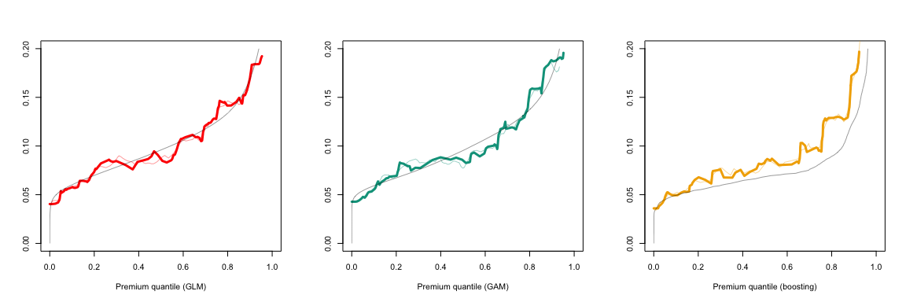<!-- -->

The following graph is a visulisation of
![s\\mapsto\\mathbb{E}\[Y|\\pi(\\boldsymbol{X})=s\]](https://latex.codecogs.com/png.latex?s%5Cmapsto%5Cmathbb%7BE%7D%5BY%7C%5Cpi%28%5Cboldsymbol%7BX%7D%29%3Ds%5D
"s\\mapsto\\mathbb{E}[Y|\\pi(\\boldsymbol{X})=s]") where
 is some premium level,
for the three models . If 
is close to 
the curve should be close to the first diagonal.

``` r
par(mfrow=c(1,4))
plot(fit_loc_glm,lwd=3,col=clrpal4[1],xlim=c(0,.2),xlab="Premium (GLM)",ylab="",ylim=c(0,.2))
abline(a=0,b=1,lwd=.4)
plot(fit_loc_gam,lwd=3,col=clrpal4[2],xlim=c(0,.2),xlab="Premium (GAM)",ylab="",ylim=c(0,.2))
abline(a=0,b=1,lwd=.4)
plot(fit_loc_bst,lwd=3,col=clrpal4[3],xlim=c(0,.2),xlab="Premium (boosting)",ylab="",ylim=c(0,.2))
abline(a=0,b=1,lwd=.4)
plot(fit_loc_nn,lwd=3,col=clrpal[4],xlim=c(0,.2),xlab="Premium (neural nets)",ylab="",ylim=c(0,.2))
abline(a=0,b=1,lwd=.4)
```

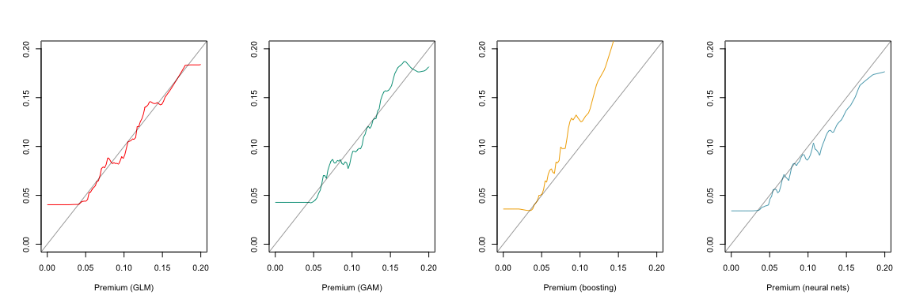<!-- -->

Since ![\\mathbb{E}\[Y|\\pi(\\boldsymbol{X})=F\_\\pi^{-1}(u)\]\\sim
F\_\\pi^{-1}(u)](https://latex.codecogs.com/png.latex?%5Cmathbb%7BE%7D%5BY%7C%5Cpi%28%5Cboldsymbol%7BX%7D%29%3DF_%5Cpi%5E%7B-1%7D%28u%29%5D%5Csim%20F_%5Cpi%5E%7B-1%7D%28u%29
"\\mathbb{E}[Y|\\pi(\\boldsymbol{X})=F_\\pi^{-1}(u)]\\sim F_\\pi^{-1}(u)")
if
, we can plot
![\\mathbb{E}\[Y|\\pi(\\boldsymbol{X})=F\_\\pi^{-1}(u)\]-
F\_\\pi^{-1}(u)](https://latex.codecogs.com/png.latex?%5Cmathbb%7BE%7D%5BY%7C%5Cpi%28%5Cboldsymbol%7BX%7D%29%3DF_%5Cpi%5E%7B-1%7D%28u%29%5D-%20F_%5Cpi%5E%7B-1%7D%28u%29
"\\mathbb{E}[Y|\\pi(\\boldsymbol{X})=F_\\pi^{-1}(u)]- F_\\pi^{-1}(u)")
which should be close to 

``` r
par(mfrow=c(1,4))
vy_glm = predict(fit_loc_glm, newdata=vx)
vy_gam = predict(fit_loc_gam, newdata=vx)
vy_bst = predict(fit_loc_bst, newdata=vx)
vy_nn = predict(fit_loc_nn, newdata=vx)
plot(q_glm,vy_glm-vx,lwd=3,col=clrpal4[1],xlim=c(0,1),xlab="Premium quantile (GLM)",ylab="",ylim=c(-.1,.1),type="l")
abline(h=0,lwd=.4)
plot(q_gam,vy_gam-vx,lwd=3,col=clrpal4[2],xlim=c(0,1),xlab="Premium quantile (GAM)",ylab="",ylim=c(-.1,.1),type="l")
abline(h=0,lwd=.4)
plot(q_bst,vy_bst-vx,lwd=3,col=clrpal4[3],xlim=c(0,1),xlab="Premium quantile (boosting)",ylab="",ylim=c(-.1,.1),type="l")
abline(h=0,lwd=.4)
plot(q_nn,vy_nn-vx,lwd=3,col=clrpal4[4],xlim=c(0,1),xlab="Premium quantile (neural nets)",ylab="",ylim=c(-.1,.1),type="l")
abline(h=0,lwd=.4)
```

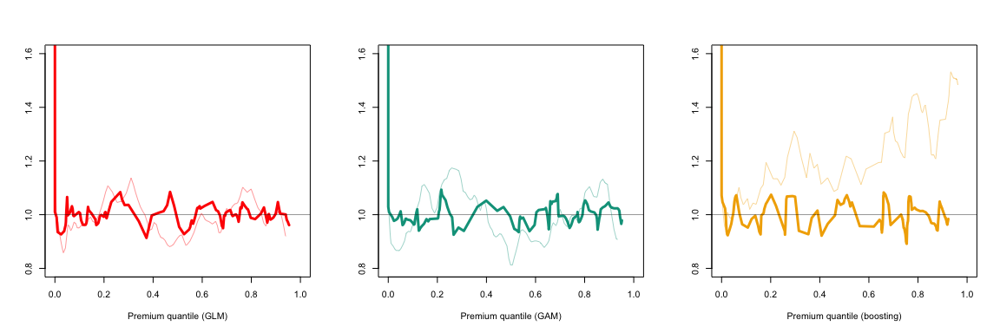<!-- -->

Observe that
![\\mathbb{E}\[Y|\\pi(\\boldsymbol{X})=F\_\\pi^{-1}(u)\]\\geq
F\_\\pi^{-1}(u)](https://latex.codecogs.com/png.latex?%5Cmathbb%7BE%7D%5BY%7C%5Cpi%28%5Cboldsymbol%7BX%7D%29%3DF_%5Cpi%5E%7B-1%7D%28u%29%5D%5Cgeq%20F_%5Cpi%5E%7B-1%7D%28u%29
"\\mathbb{E}[Y|\\pi(\\boldsymbol{X})=F_\\pi^{-1}(u)]\\geq F_\\pi^{-1}(u)")
which reflects the local bias of the estimator
 (except
perhaps for very low risks). Other plots can be used to visualised using
the following plots.

Since ![\\mathbb{E}\[Y|\\pi(\\boldsymbol{X})=F\_\\pi^{-1}(u)\]\\sim
F\_\\pi^{-1}(u)](https://latex.codecogs.com/png.latex?%5Cmathbb%7BE%7D%5BY%7C%5Cpi%28%5Cboldsymbol%7BX%7D%29%3DF_%5Cpi%5E%7B-1%7D%28u%29%5D%5Csim%20F_%5Cpi%5E%7B-1%7D%28u%29
"\\mathbb{E}[Y|\\pi(\\boldsymbol{X})=F_\\pi^{-1}(u)]\\sim F_\\pi^{-1}(u)")
if
, we can plot
![\\mathbb{E}\[Y|\\pi(\\boldsymbol{X})=F\_\\pi^{-1}(u)\]/F\_\\pi^{-1}(u)](https://latex.codecogs.com/png.latex?%5Cmathbb%7BE%7D%5BY%7C%5Cpi%28%5Cboldsymbol%7BX%7D%29%3DF_%5Cpi%5E%7B-1%7D%28u%29%5D%2FF_%5Cpi%5E%7B-1%7D%28u%29
"\\mathbb{E}[Y|\\pi(\\boldsymbol{X})=F_\\pi^{-1}(u)]/F_\\pi^{-1}(u)")
which should be close to ,

``` r
par(mfrow=c(1,4))
plot(q_glm,vy_glm/vx,lwd=3,col=clrpal4[1],xlim=c(0,1),xlab="Premium quantile (GLM)",ylab="",ylim=c(.8,1.6),type="l")
abline(h=1,lwd=.4)
plot(q_gam,vy_gam/vx,lwd=3,col=clrpal4[2],xlim=c(0,1),xlab="Premium quantile (GAM)",ylab="",ylim=c(.8,1.6),type="l")
abline(h=1,lwd=.4)
plot(q_bst,vy_bst/vx,lwd=3,col=clrpal4[3],xlim=c(0,1),xlab="Premium quantile (boosting)",ylab="",ylim=c(.8,1.6),type="l")
abline(h=1,lwd=.4)
plot(q_nn,vy_nn/vx,lwd=3,col=clrpal4[4],xlim=c(0,1),xlab="Premium quantile (neural nets)",ylab="",ylim=c(.8,1.6),type="l")
abline(h=1,lwd=.4)
```

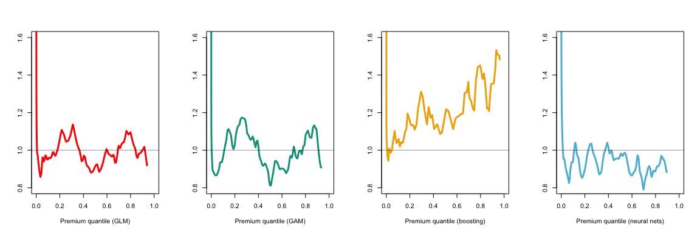<!-- -->

This function can be used for a correction.

# On Neural-Networks non reproducibility

Using [keras](https://keras.io/) it is difficult to replicate the neural
network fit. Here are 250 fits *on the same training database*

For convenience, we simply use the outputs of `k=250` fits of the
routine described previously: three objects were created, `m` (a
-dimensional vector)
that contains the overall prediction (to be compared with `0.1091`
obtained with the GLM model); `x` (a 
matrix) that contains all the probabilities
 used for quantile
computations and `y` (a 
matrix) that contains all predictions
![\\mathbb{E}\[Y|\\widehat{\\pi}=F^{-1}\_{\\widehat{\\pi}}(u)\]](https://latex.codecogs.com/png.latex?%5Cmathbb%7BE%7D%5BY%7C%5Cwidehat%7B%5Cpi%7D%3DF%5E%7B-1%7D_%7B%5Cwidehat%7B%5Cpi%7D%7D%28u%29%5D
"\\mathbb{E}[Y|\\widehat{\\pi}=F^{-1}_{\\widehat{\\pi}}(u)]")

``` r
par(mfrow=c(1,4))
plot(density(m),col=colr[4],main="",xlab="Global prediction (neural nets)",ylab="")
abline(v=0.1091,col=colr[1])
text(0.1091,80,pos=2,"GLM",col=colr[1])

plot(x[,1],y[,1],ylim=c(.8,1.5),col=scales::alpha(colr[4],.2),type="l",xlab="Premium quantile (neural nets)",ylab="")
for(i in 2:ncol(x)){
  lines(x[,i],y[,i],col=scales::alpha(colr[4],.2))
}
abline(h=1,lwd=4)
lines(v_u,v_v,lwd=3,col=colr[4])
```

<!-- -->

# Correction

We will use
![\\mathbb{E}\[Y|\\pi(\\boldsymbol{X})=F\_\\pi^{-1}(u)\]/F\_\\pi^{-1}(u)](https://latex.codecogs.com/png.latex?%5Cmathbb%7BE%7D%5BY%7C%5Cpi%28%5Cboldsymbol%7BX%7D%29%3DF_%5Cpi%5E%7B-1%7D%28u%29%5D%2FF_%5Cpi%5E%7B-1%7D%28u%29
"\\mathbb{E}[Y|\\pi(\\boldsymbol{X})=F_\\pi^{-1}(u)]/F_\\pi^{-1}(u)") as
a multiplier to correct
.

``` r
p_glm = predict(fit_loc_glm,newdata = valid_prime_glm)
p_gam = predict(fit_loc_gam,newdata = valid_prime_gam)
p_bst = predict(fit_loc_bst,newdata = valid_prime_bst)
p_nn = predict(fit_loc_nn,newdata = valid_prime_nn)
vx = seq(0,.2,length=251)
library(locfit)
valid_prime_glm_bc = valid_prime_glm * (p_glm/valid_prime_glm)
valid_prime_gam_bc = valid_prime_gam * (p_gam/valid_prime_gam) 
valid_prime_bst_bc = valid_prime_bst * (p_bst/valid_prime_bst)
valid_prime_nn_bc = valid_prime_nn * (p_nn/valid_prime_nn)
q_glm_bc = q_gam_bc = q_bst_bc = q_nn_bc = rep(NA,length(vx))
```

``` r
for(i in 1:length(vx)){
  q_glm_bc[i] = mean(valid_prime_glm_bc<=vx[i])
  q_gam_bc[i] = mean(valid_prime_gam_bc<=vx[i])
  q_bst_bc[i] = mean(valid_prime_bst_bc<=vx[i])
  q_nn_bc[i] = mean(valid_prime_nn_bc<=vx[i])
}
```

As we can see, we were able to correct the global bias

``` r
desc(valid_prime_glm_bc)
```

    ##   mean    10%    90% 
    ## 0.1051 0.0573 0.1687

``` r
desc(valid_prime_gam_bc)
```

    ##   mean    10%    90% 
    ## 0.1059 0.0570 0.1806

``` r
desc(valid_prime_bst_bc)
```

    ##   mean    10%    90% 
    ## 0.1028 0.0518 0.1711

``` r
desc(valid_prime_nn_bc)
```

    ##   mean    10%    90% 
    ## 0.1051 0.0499 0.1776

``` r
fit_loc_glm_bc = locfit.raw(x=valid_prime_glm_bc, 
                 y=valid_LM[,"ClaimNb"]/valid_LM[,"Exposure"], 
                 weights=valid_LM[,"Exposure"], 
                 kern="rect",deg=0,alpha=.05)
fit_loc_gam_bc = locfit.raw(x=valid_prime_gam_bc, 
                 y=valid_LM[,"ClaimNb"]/valid_LM[,"Exposure"], 
                 weights=valid_LM[,"Exposure"], 
                 kern="rect",deg=0,alpha=.05)
fit_loc_bst_bc = locfit.raw(x=valid_prime_bst_bc, 
                 y=valid_LM[,"ClaimNb"]/valid_LM[,"Exposure"], 
                 weights=valid_LM[,"Exposure"], 
                 kern="rect",deg=0,alpha=.05)
fit_loc_nn_bc = locfit.raw(x=valid_prime_nn_bc, 
                 y=valid_LM[,"ClaimNb"]/valid_LM[,"Exposure"], 
                 weights=valid_LM[,"Exposure"], 
                 kern="rect",deg=0,alpha=.05)
```

We can compare the two models,
 and


``` r
vu=(0:200)/200
Q_glm = quantile(valid_prime_glm, probs = vu)[3:199]
Q_gam = quantile(valid_prime_gam, probs = vu)[3:199]
Q_bst = quantile(valid_prime_bst, probs = vu)[3:199]
Q_nn  = quantile(valid_prime_nn, probs = vu)[3:199]
Q_glm_bc = quantile(valid_prime_glm_bc, probs = vu)[3:199]
Q_gam_bc = quantile(valid_prime_gam_bc, probs = vu)[3:199]
Q_bst_bc = quantile(valid_prime_bst_bc, probs = vu)[3:199]
Q_nn_bc  = quantile(valid_prime_nn_bc, probs = vu)[3:199]
idxs = sample(1:nrow(valid_LM),size=500)
par(mfrow=c(1,4))
plot(Q_glm, Q_glm_bc, lwd=3, col=clrpal4[1], type="l",
     xlab="Premium (GLM)",ylab="Premium BC (GLM)",
     xlim=c(0,.2),ylim=c(0,.2))
abline(a=0,b=1,lwd=.4)
plot(Q_gam, Q_gam_bc, lwd=3, col=clrpal4[2], type="l",
     xlab="Premium (GAM)",ylab="Premium BC (GAM)",
     xlim=c(0,.2),ylim=c(0,.2))
abline(a=0,b=1,lwd=.4)
plot(Q_bst, Q_bst_bc, lwd=3, col=clrpal4[3], type="l",
     xlab="Premium (boosting)",ylab="Premium BC (boosting)",
     xlim=c(0,.2),ylim=c(0,.2))
abline(a=0,b=1,lwd=.4)
plot(Q_bst, Q_nn_bc, lwd=3, col=clrpal4[4], type="l",
     xlab="Premium (boosting)",ylab="Premium BC (neural nets)",
     xlim=c(0,.2),ylim=c(0,.2))
abline(a=0,b=1,lwd=.4)
```

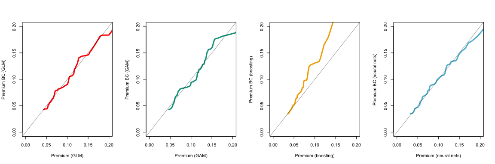<!-- -->

``` r
par(mfrow=c(1,4))
plot(Q_glm, Q_glm_bc, lwd=3, col="white", type="l",
     xlab="Premium (GLM)",ylab="Premium BC (GLM)",
     xlim=c(0,.2),ylim=c(0,.2))
points(valid_prime_glm[idxs],valid_prime_glm_bc[idxs],pch=1,cex=.4,col=scales::alpha(clrpal4[1],.4))
abline(a=0,b=1,lwd=.4)
plot(Q_gam, Q_gam_bc, lwd=3, col="white", type="l",
     xlab="Premium (GAM)",ylab="Premium BC (GAM)",
     xlim=c(0,.2),ylim=c(0,.2))
points(valid_prime_gam[idxs],valid_prime_gam_bc[idxs],pch=1,cex=.4,col=scales::alpha(clrpal4[2],.4))
abline(a=0,b=1,lwd=.4)
plot(Q_bst, Q_bst_bc, lwd=3, col="white", type="l",
     xlab="Premium (boosting)",ylab="Premium BC (boosting)",
     xlim=c(0,.2),ylim=c(0,.2))
points(valid_prime_bst[idxs],valid_prime_bst_bc[idxs],pch=1,cex=.4,col=scales::alpha(clrpal4[3],.4))
abline(a=0,b=1,lwd=.4)
plot(Q_nn, Q_nn_bc, lwd=3, col="white", type="l",
     xlab="Premium (neural nets)",ylab="Premium BC (neural nets)",
     xlim=c(0,.2),ylim=c(0,.2))
points(valid_prime_nn[idxs],valid_prime_nn_bc[idxs],pch=1,cex=.4,col=scales::alpha(clrpal4[4],.4))
abline(a=0,b=1,lwd=.4)
```

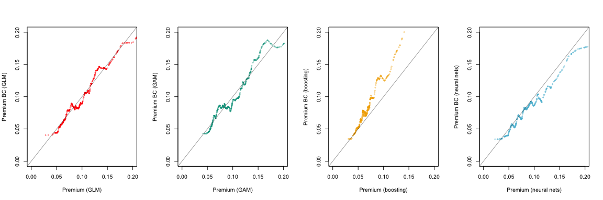<!-- -->

The histograms are below are the distributions of the premiums using


``` r
par(mfrow=c(1,4))
hist(valid_prime_glm_bc, breaks = (0:(207*max(valid_prime_glm_bc)))/200,xlim=c(0,.2),col=clrpal4[1],border="white",
     main="",xlab="Premium BC (GLM)",ylab="",ylim=c(0,37000))
hist(valid_prime_gam_bc, breaks = (0:(207*max(valid_prime_gam_bc)))/200,xlim=c(0,.2),col=clrpal4[2],border="white",
     main="",xlab="Premium BC (GAM)",ylab="",ylim=c(0,37000))
hist(valid_prime_bst_bc, breaks = (0:(207*max(valid_prime_bst_bc)))/200,xlim=c(0,.2),col=clrpal4[3],border="white",
     main="",xlab="Premium BC (boosting)",ylab="",ylim=c(0,37000))
hist(valid_prime_nn_bc, breaks = (0:(207*max(valid_prime_nn_bc)))/200,xlim=c(0,.2),col=clrpal4[4],border="white",
     main="",xlab="Premium BC (neural nets)",ylab="",ylim=c(0,37000))
```

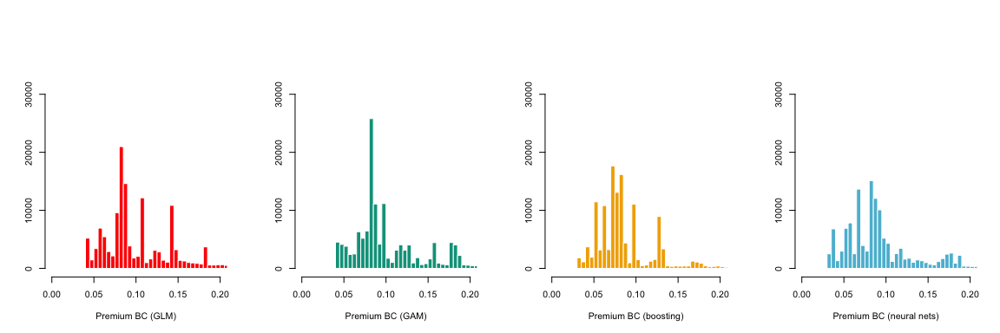<!-- -->

The following graph is a visulisation of
![s\\mapsto\\mathbb{E}\[Y|\\pi\_{BC}(\\boldsymbol{X})=s\]](https://latex.codecogs.com/png.latex?s%5Cmapsto%5Cmathbb%7BE%7D%5BY%7C%5Cpi_%7BBC%7D%28%5Cboldsymbol%7BX%7D%29%3Ds%5D
"s\\mapsto\\mathbb{E}[Y|\\pi_{BC}(\\boldsymbol{X})=s]") where
 is some premium level,
for the three models
. Observe that
 is closer to
 than
.

``` r
par(mfrow=c(1,4))
plot(fit_loc_glm_bc,lwd=3,col=clrpal4[1],xlim=c(0,.2),xlab="Premium BC (GLM)",ylab="",ylim=c(0,.2))
lines(fit_loc_glm,col=scales::alpha(clrpal4[1],.4))
abline(a=0,b=1,lwd=.4)
plot(fit_loc_gam_bc,lwd=3,col=clrpal4[2],xlim=c(0,.2),xlab="Premium BC (GAM)",ylab="",ylim=c(0,.2))
lines(fit_loc_gam,col=scales::alpha(clrpal4[2],.4))
abline(a=0,b=1,lwd=.4)
plot(fit_loc_bst_bc,lwd=3,col=clrpal4[3],xlim=c(0,.2),xlab="Premium BC (boosting)",ylab="",ylim=c(0,.2))
lines(fit_loc_bst,col=scales::alpha(clrpal4[3],.4))
abline(a=0,b=1,lwd=.4)
plot(fit_loc_nn_bc,lwd=3,col=clrpal4[4],xlim=c(0,.2),xlab="Premium BC (neural nets)",ylab="",ylim=c(0,.2))
lines(fit_loc_nn,col=scales::alpha(clrpal4[4],.4))
abline(a=0,b=1,lwd=.4)
```

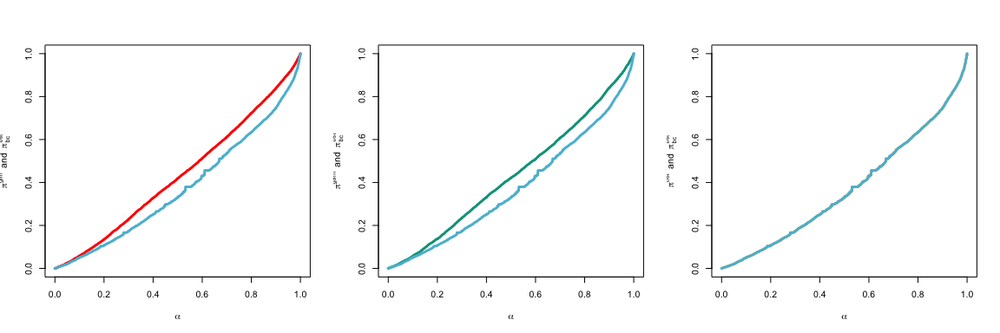<!-- -->

The following graph is a visulisation of
![u\\mapsto\\mathbb{E}\[Y|\\pi(\\boldsymbol{X})=F\_\\pi^{-1}(u)\]](https://latex.codecogs.com/png.latex?u%5Cmapsto%5Cmathbb%7BE%7D%5BY%7C%5Cpi%28%5Cboldsymbol%7BX%7D%29%3DF_%5Cpi%5E%7B-1%7D%28u%29%5D
"u\\mapsto\\mathbb{E}[Y|\\pi(\\boldsymbol{X})=F_\\pi^{-1}(u)]") where
 is some probability
level

``` r
par(mfrow=c(1,4))
vy_glm_bc = predict(fit_loc_glm_bc, newdata=vx)
vy_gam_bc = predict(fit_loc_gam_bc, newdata=vx)
vy_bst_bc = predict(fit_loc_bst_bc, newdata=vx)
vy_nn_bc = predict(fit_loc_nn_bc, newdata=vx)
plot(q_glm_bc,vy_glm_bc,lwd=3,col=clrpal4[1],xlim=c(0,1),xlab="Premium quantile (GLM)",ylab="",ylim=c(0,.2),type="l")
lines(q_glm,vx,lwd=.4)
lines(q_glm,vy_glm,col=scales::alpha(clrpal4[1],.4))
plot(q_gam_bc,vy_gam_bc,lwd=3,col=clrpal4[2],xlim=c(0,1),xlab="Premium quantile (GAM)",ylab="",ylim=c(0,.2),type="l")
lines(q_gam,vx,lwd=.4)
lines(q_gam,vy_gam,col=scales::alpha(clrpal4[2],.4))
plot(q_bst_bc,vy_bst_bc,lwd=3,col=clrpal4[3],xlim=c(0,1),xlab="Premium quantile (boosting)",ylab="",ylim=c(0,.2),type="l")
lines(q_bst,vx,lwd=.4)
lines(q_bst,vy_bst,col=scales::alpha(clrpal4[3],.4))
plot(q_nn_bc,vy_nn_bc,lwd=3,col=clrpal4[4],xlim=c(0,1),xlab="Premium quantile (neural nets)",ylab="",ylim=c(0,.2),type="l")
lines(q_nn,vx,lwd=.4)
lines(q_nn,vy_nn,col=scales::alpha(clrpal4[4],.4))
```

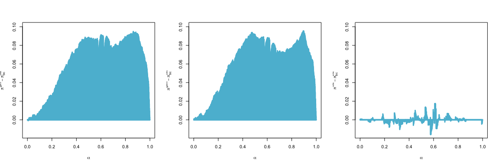<!-- -->

since ![\\mathbb{E}\[Y|\\pi(\\boldsymbol{X})=F\_\\pi^{-1}(u)\]\\sim
F\_\\pi^{-1}(u)](https://latex.codecogs.com/png.latex?%5Cmathbb%7BE%7D%5BY%7C%5Cpi%28%5Cboldsymbol%7BX%7D%29%3DF_%5Cpi%5E%7B-1%7D%28u%29%5D%5Csim%20F_%5Cpi%5E%7B-1%7D%28u%29
"\\mathbb{E}[Y|\\pi(\\boldsymbol{X})=F_\\pi^{-1}(u)]\\sim F_\\pi^{-1}(u)")
if
, we can plot
![\\mathbb{E}\[Y|\\pi(\\boldsymbol{X})=F\_\\pi^{-1}(u)\]-
F\_\\pi^{-1}(u)](https://latex.codecogs.com/png.latex?%5Cmathbb%7BE%7D%5BY%7C%5Cpi%28%5Cboldsymbol%7BX%7D%29%3DF_%5Cpi%5E%7B-1%7D%28u%29%5D-%20F_%5Cpi%5E%7B-1%7D%28u%29
"\\mathbb{E}[Y|\\pi(\\boldsymbol{X})=F_\\pi^{-1}(u)]- F_\\pi^{-1}(u)")
which should be close to 

``` r
par(mfrow=c(1,4))
plot(q_glm_bc,vy_glm_bc-vx,lwd=3,col=clrpal4[1],xlim=c(0,1),xlab="Premium quantile (GLM)",ylab="",ylim=c(-.1,.1),type="l")
abline(h=0,lwd=.4)
lines(q_glm,vy_glm-vx,col=scales::alpha(clrpal4[1],.4))
plot(q_gam_bc,vy_gam_bc-vx,lwd=3,col=clrpal4[2],xlim=c(0,1),xlab="Premium quantile (GAM)",ylab="",ylim=c(-.1,.1),type="l")
abline(h=0,lwd=.4)
lines(q_gam,vy_gam-vx,col=scales::alpha(clrpal4[2],.4))
plot(q_bst_bc,vy_bst_bc-vx,lwd=3,col=clrpal4[3],xlim=c(0,1),xlab="Premium quantile (boosting)",ylab="",ylim=c(-.1,.1),type="l")
abline(h=0,lwd=.4)
lines(q_bst,vy_bst-vx,col=scales::alpha(clrpal4[3],.4))
plot(q_nn_bc,vy_nn_bc-vx,lwd=3,col=clrpal4[4],xlim=c(0,1),xlab="Premium quantile (neural nets)",ylab="",ylim=c(-.1,.1),type="l")
abline(h=0,lwd=.4)
lines(q_nn,vy_nn-vx,col=scales::alpha(clrpal4[4],.4))
```

<!-- -->

since ![\\mathbb{E}\[Y|\\pi(\\boldsymbol{X})=F\_\\pi^{-1}(u)\]\\sim
F\_\\pi^{-1}(u)](https://latex.codecogs.com/png.latex?%5Cmathbb%7BE%7D%5BY%7C%5Cpi%28%5Cboldsymbol%7BX%7D%29%3DF_%5Cpi%5E%7B-1%7D%28u%29%5D%5Csim%20F_%5Cpi%5E%7B-1%7D%28u%29
"\\mathbb{E}[Y|\\pi(\\boldsymbol{X})=F_\\pi^{-1}(u)]\\sim F_\\pi^{-1}(u)")
if
, we can plot
![\\mathbb{E}\[Y|\\pi(\\boldsymbol{X})=F\_\\pi^{-1}(u)\]/F\_\\pi^{-1}(u)](https://latex.codecogs.com/png.latex?%5Cmathbb%7BE%7D%5BY%7C%5Cpi%28%5Cboldsymbol%7BX%7D%29%3DF_%5Cpi%5E%7B-1%7D%28u%29%5D%2FF_%5Cpi%5E%7B-1%7D%28u%29
"\\mathbb{E}[Y|\\pi(\\boldsymbol{X})=F_\\pi^{-1}(u)]/F_\\pi^{-1}(u)")
which should be close to ,

``` r
par(mfrow=c(1,4))
plot(q_glm_bc,vy_glm_bc/vx,lwd=3,col=clrpal4[1],xlim=c(0,1),xlab="Premium quantile (GLM)",ylab="",ylim=c(.8,1.6),type="l")
abline(h=1,lwd=.4)
lines(q_glm,vy_glm/vx,col=scales::alpha(clrpal4[1],.4))
plot(q_gam_bc,vy_gam_bc/vx,lwd=3,col=clrpal4[2],xlim=c(0,1),xlab="Premium quantile (GAM)",ylab="",ylim=c(.8,1.6),type="l")
abline(h=1,lwd=.4)
lines(q_gam,vy_gam/vx,col=scales::alpha(clrpal4[2],.4))
plot(q_bst_bc,vy_bst_bc/vx,lwd=3,col=clrpal4[3],xlim=c(0,1),xlab="Premium quantile (boosting)",ylab="",ylim=c(.8,1.6),type="l")
abline(h=1,lwd=.4)
lines(q_bst,vy_bst/vx,col=scales::alpha(clrpal4[3],.4))
plot(q_nn_bc,vy_nn_bc/vx,lwd=3,col=clrpal4[4],xlim=c(0,1),xlab="Premium quantile (neural nets)",ylab="",ylim=c(.8,1.6),type="l")
abline(h=1,lwd=.4)
lines(q_nn,vy_nn/vx,col=scales::alpha(clrpal4[4],.4))
```

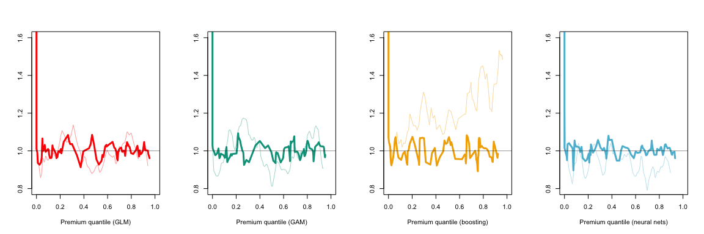<!-- -->

# Partial Dependence Plots

In order to understand the changes of the model, from
 to
 it is possible to look at partial dependence plots. Given a
variable of interest  out of
, consider ![x\\mapsto
E\[\\pi(x,\\boldsymbol{X}\_{-k})\]](https://latex.codecogs.com/png.latex?x%5Cmapsto%20E%5B%5Cpi%28x%2C%5Cboldsymbol%7BX%7D_%7B-k%7D%29%5D
"x\\mapsto E[\\pi(x,\\boldsymbol{X}_{-k})]") where
") corresponds to vector
 where  is substituted to . The empirical version is   
 = \\frac{1}{n}\\sum_{i=1}^n \\pi(x_{1,i},\\cdots,x_{k-1,i},x,x_{k+1,i},\\cdots,x_{p,i}).
")  

``` r
pdp_glm = function(x ){
  new_valid_LM = valid_LM_1
  new_valid_LM$DrivAge = x
y = prime_1 = predict(reg_glm, newdata=new_valid_LM,type="response")
py = predict(fit_loc_glm, newdata = y)/y
prime_2 = y*py
c(mean(prime_1),mean(prime_2))
}
pdp_gam = function(x ){
  new_valid_LM = valid_LM_1
  new_valid_LM$DrivAge = x
y = prime_1 = predict(reg_gam, newdata=new_valid_LM,type="response")
py = predict(fit_loc_gam, newdata = y)/y
prime_2 = y*py
c(mean(prime_1),mean(prime_2))
}
pdp_bst = function(x ){
  new_valid_LM = valid_LM_h2o_1
  new_valid_LM$DrivAge = x
y = prime_1 = as.vector(h2o.predict(object = reg_bst, newdata=as.h2o(new_valid_LM)))
py = predict(fit_loc_bst, newdata = y)/y
prime_2 = y*py
c(mean(prime_1),mean(prime_2))
}
pdp_nn = function(x ){
  new_Xlearn = Xlearn
  new_Xlearn[,"DrivAgeX"] = rep(x,nrow(Xlearn))
  #fit_x = model %>% fit(list(new_Xlearn, Brlearn, Relearn, Vlearn), Ylearn, epochs=100, batch_size=10000, verbose=0, validation_split=0)
y = prime_1 = as.vector(as.vector(model %>% predict(list(new_Xlearn, Brlearn, Relearn, Vlearn))))
py = predict(fit_loc_nn, newdata = y)/y
prime_2 = y*py
c(mean(prime_1),mean(prime_2))
}
pdp_nn(45)
```

    ## [1] 0.3684745 0.2490799

``` r
pdp_bst(45)
```

    ## [1] 0.09068346 0.11468242

``` r
V_pdp_glm= Vectorize(pdp_glm)(18:80)
V_pdp_gam = Vectorize(pdp_gam)(18:80)
V_pdp_bst = Vectorize(pdp_bst)(18:80)
V_pdp_nn = Vectorize(pdp_nn)(18:80)
```

The first variable of interest is the age of the driver `DrivAge`

``` r
par(mfrow=c(1,4))
plot(18:80,V_pdp_glm[2,],type="l",col=clrpal4[1],xlab="Age (GLM)",ylab="",lwd=3,ylim=c(.05,.15))
lines(18:80,V_pdp_glm[1,],col=scales::alpha(clrpal4[1],.4),lwd=3)

plot(18:80,V_pdp_gam[2,],type="l",col=clrpal4[2],xlab="Age (GAM)",ylab="",lwd=3,ylim=c(.05,.15))
lines(18:80,V_pdp_gam[1,],col=scales::alpha(clrpal4[2],.4),lwd=3)

plot(18:80,V_pdp_bst[2,],type="l",col=clrpal4[3],xlab="Age (boosting)",ylab="",lwd=3,ylim=c(.05,.15))
lines(18:80,V_pdp_bst[1,],col=scales::alpha(clrpal4[3],.4),lwd=3)
```

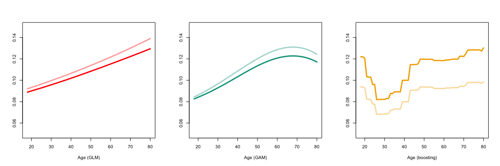<!-- -->

``` r
pdp_glm = function(x ){
  new_valid_LM = valid_LM_1
  new_valid_LM$Density = x
y = prime_1 = predict(reg_glm, newdata=new_valid_LM,type="response")
py = predict(fit_loc_glm, newdata = y)/y
prime_2 = y*py
c(mean(prime_1),mean(prime_2))
}
pdp_gam = function(x ){
  new_valid_LM = valid_LM_1
  new_valid_LM$Density = x
y = prime_1 = predict(reg_gam, newdata=new_valid_LM,type="response")
py = predict(fit_loc_gam, newdata = y)/y
prime_2 = y*py
c(mean(prime_1),mean(prime_2))
}
pdp_bst = function(x ){
  new_valid_LM = valid_LM_h2o_1
  new_valid_LM$Density = x
y = prime_1 = as.vector(h2o.predict(object = reg_bst, newdata=as.h2o(new_valid_LM)))
py = predict(fit_loc_bst, newdata = y)/y
prime_2 = y*py
c(mean(prime_1),mean(prime_2))
}
pdp_nn = function(x ){
  new_Xlearn = Xlearn
  new_Xlearn[,"DensityX"] = rep(x,nrow(Xlearn))
#  fit_x = model %>% fit(list(new_Xlearn, Brlearn, Relearn, Vlearn), Ylearn, epochs=100, batch_size=10000, verbose=0, validation_split=0)
y = prime_1 = as.vector(as.vector(model %>% predict(list(new_Xlearn, Brlearn, Relearn, Vlearn))))
py = predict(fit_loc_nn, newdata = y)/y
prime_2 = y*py
c(mean(prime_1),mean(prime_2))
}
VD = quantile(valid_LM$Density,(1:99)/100)
V_pdp_glm = Vectorize(pdp_glm)(VD)
V_pdp_gam = Vectorize(pdp_gam)(VD)
V_pdp_bst = Vectorize(pdp_bst)(VD)
```

The following partial dependence plot is for the density in the town of
the driver, `Density` (either as a function of the density, or its
logarithm)

``` r
par(mfrow=c(1,4))
plot(VD,V_pdp_glm[2,],type="l",col=clrpal4[1],xlab="Population Density (GLM)",ylab="",lwd=3,ylim=c(.05,.15))
lines(VD,V_pdp_glm[1,],col=scales::alpha(clrpal4[1],.4),lwd=3)

plot(VD,V_pdp_gam[2,],type="l",col=clrpal4[2],xlab="Population Density (GAM)",ylab="",lwd=3,ylim=c(.05,.15))
lines(VD,V_pdp_gam[1,],col=scales::alpha(clrpal4[2],.4),lwd=3)

plot(VD,V_pdp_bst[2,],type="l",col=clrpal4[3],xlab="Population Density (boosting)",ylab="",lwd=3,ylim=c(.05,.15))
lines(VD,V_pdp_bst[1,],col=scales::alpha(clrpal4[3],.4),lwd=3)```

<!-- -->

``` r
par(mfrow=c(1,4))
plot(VD,V_pdp_glm[1,],type="l",col=scales::alpha(clrpal4[1],.4),xlab="Population Density (GLM) log scale",log="x",ylab="",lwd=3,ylim=c(.05,.15))
lines(VD,V_pdp_glm[2,],col=scales::alpha(clrpal4[1],1),lwd=3)

plot(VD,V_pdp_gam[1,],type="l",col=scales::alpha(clrpal4[2],.4),xlab="Population Density (GAM) log scale",log="x",ylab="",lwd=3,ylim=c(.05,.15))
lines(VD,V_pdp_gam[2,],col=scales::alpha(clrpal4[2],1),lwd=3)

plot(VD,V_pdp_bst[1,],type="l",col=scales::alpha(clrpal4[3],.4),xlab="Population Density (boosting) log scale",log="x",ylab="",lwd=3,ylim=c(.05,.15))
lines(VD,V_pdp_bst[2,],col=scales::alpha(clrpal4[3],1),lwd=3)
```

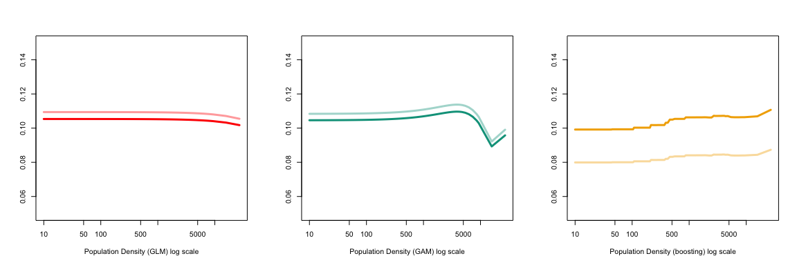<!-- -->

# Correlation

We can also consider the correlation between models
 and the
associated corrected versions


``` r
X = cbind(valid_prime_glm,valid_prime_gam,valid_prime_bst,
          valid_prime_nn,valid_prime_glm_bc,valid_prime_gam_bc,
          valid_prime_bst_bc,valid_prime_nn_bc)
M1=stats::cor(X,method="pearson")
M2=stats::cor(X,method="spearman")
library(corrplot)
colnames(M2)[1]=rownames(M2)[1]="glm"
colnames(M2)[2]=rownames(M2)[2]="gam"
colnames(M2)[3]=rownames(M2)[3]="bst"
colnames(M2)[4]=rownames(M2)[4]="nn"
colnames(M2)[5]=rownames(M2)[5]="glm BC"
colnames(M2)[6]=rownames(M2)[6]="gam BC"
colnames(M2)[7]=rownames(M2)[7]="bst BC"
colnames(M2)[8]=rownames(M2)[8]="nn BC"
corrplot(M2, method="number")
```

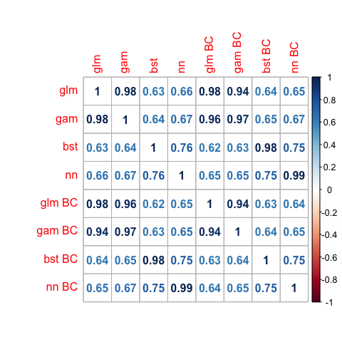<!-- -->

# Concentration Curves

Finally, we can plot concentration curves. The concentration curve of
the true premium  with respect to the model
 based on the
information contained in the vector
 is defined there as   
![
\\alpha\\mapsto C\[\\mu,\\pi;\\alpha\]
\=\\frac{\\mathbb{E}\\big\[\\mu(\\boldsymbol{X})\\boldsymbol{1}\[\\pi\\boldsymbol{X})\\leq
F\_{\\pi}^{-1}(\\alpha)\]\\big\]}
{\\mathbb{E}\[\\mu(\\boldsymbol{X})\]}
](https://latex.codecogs.com/png.latex?%0A%5Calpha%5Cmapsto%20C%5B%5Cmu%2C%5Cpi%3B%5Calpha%5D%0A%3D%5Cfrac%7B%5Cmathbb%7BE%7D%5Cbig%5B%5Cmu%28%5Cboldsymbol%7BX%7D%29%5Cboldsymbol%7B1%7D%5B%5Cpi%5Cboldsymbol%7BX%7D%29%5Cleq%20F_%7B%5Cpi%7D%5E%7B-1%7D%28%5Calpha%29%5D%5Cbig%5D%7D%0A%7B%5Cmathbb%7BE%7D%5B%5Cmu%28%5Cboldsymbol%7BX%7D%29%5D%7D%0A
"
\\alpha\\mapsto C[\\mu,\\pi;\\alpha]
=\\frac{\\mathbb{E}\\big[\\mu(\\boldsymbol{X})\\boldsymbol{1}[\\pi\\boldsymbol{X})\\leq F_{\\pi}^{-1}(\\alpha)]\\big]}
{\\mathbb{E}[\\mu(\\boldsymbol{X})]}
")  

``` r
CC = function(alpha, pi, y){
  q = quantile(pi,alpha)
  sum(y * (pi<=q))/sum(y)
}
valpha= seq(0,1,by=.001)
v_prime_glm = Vectorize(function(a) CC(a,pi=valid_prime_glm,y=valid_LM$ClaimNb))(valpha)
v_prime_gam = Vectorize(function(a) CC(a,pi=valid_prime_gam,y=valid_LM$ClaimNb))(valpha)
v_prime_bst = Vectorize(function(a) CC(a,pi=valid_prime_bst,y=valid_LM$ClaimNb))(valpha)
v_prime_nn = Vectorize(function(a) CC(a,pi=valid_prime_nn,y=valid_LM$ClaimNb))(valpha)


v_prime_glm_bc = Vectorize(function(a) CC(a,pi=valid_prime_glm_bc,y=valid_LM$ClaimNb))(valpha)
v_prime_gam_bc = Vectorize(function(a) CC(a,pi=valid_prime_gam_bc,y=valid_LM$ClaimNb))(valpha) 
v_prime_bst_bc = Vectorize(function(a) CC(a,pi=valid_prime_bst_bc,y=valid_LM$ClaimNb))(valpha) 
v_prime_nn_bc = Vectorize(function(a) CC(a,pi=valid_prime_nn_bc,y=valid_LM$ClaimNb))(valpha) 
```

``` r
par(mfrow=c(1,2))
plot(valpha,v_prime_glm,type="l",lwd=3,col=clrpal4[1],xlim=c(0,1),ylim=c(0,1),
     xlab=expression(alpha),ylab=expression(pi^glm - pi[bc]^bst))
lines(valpha,v_prime_bst_bc,type="l",lwd=3,col=clrpal4[3])
plot(valpha,v_prime_glm-v_prime_bst_bc,type="h",lwd=3,col=clrpal4[4],xlim=c(0,1),
     xlab=expression(alpha),ylab=expression(pi^glm - pi[bc]^bst))
```

<!-- -->

``` r
par(mfrow=c(1,2))
plot(valpha,v_prime_gam,type="l",lwd=3,col=clrpal4[1],xlim=c(0,1),ylim=c(0,1),
     xlab=expression(alpha),ylab=expression(pi^gam - pi[bc]^bst))
lines(valpha,v_prime_bst_bc,type="l",lwd=3,col=clrpal4[3])
plot(valpha,v_prime_gam-v_prime_bst_bc,type="h",lwd=3,col=clrpal4[4],xlim=c(0,1),
     xlab=expression(alpha),ylab=expression(pi^gam - pi[bc]^bst))
```

<!-- -->

``` r
idx = which(valid_LM$Exposure == 1)
v_prime_glm_i = Vectorize(function(a) CC(a,pi=valid_prime_glm[idx],y=valid_LM$ClaimNb[idx]))(valpha)
v_prime_gam_i = Vectorize(function(a) CC(a,pi=valid_prime_gam[idx],y=valid_LM$ClaimNb[idx]))(valpha) 
v_prime_bst_i = Vectorize(function(a) CC(a,pi=valid_prime_bst[idx],y=valid_LM$ClaimNb[idx]))(valpha) 
v_prime_glm_bc_i = Vectorize(function(a) CC(a,pi=valid_prime_glm_bc[idx],y=valid_LM$ClaimNb[idx]))(valpha)
v_prime_gam_bc_i = Vectorize(function(a) CC(a,pi=valid_prime_gam_bc[idx],y=valid_LM$ClaimNb[idx]))(valpha) 
v_prime_bst_bc_i = Vectorize(function(a) CC(a,pi=valid_prime_bst_bc[idx],y=valid_LM$ClaimNb[idx]))(valpha) 
```

``` r
par(mfrow=c(1,4))
plot(valpha,v_prime_glm,type="l",lwd=3,col=clrpal4[1],xlim=c(0,1),ylim=c(0,1),
     xlab=expression(alpha),ylab=expression(pi^glm ~" and "~ pi[bc]^bst))
lines(valpha,v_prime_bst,type="l",lwd=3,col=clrpal4[4])

plot(valpha,v_prime_gam,type="l",lwd=3,col=clrpal4[2],xlim=c(0,1),
     xlab=expression(alpha),ylab=expression(pi^gam  ~" and "~ pi[bc]^bst))
lines(valpha,v_prime_bst,type="l",lwd=3,col=clrpal4[4])

plot(valpha,v_prime_bst,type="l",lwd=3,col=clrpal4[3],xlim=c(0,1),
     xlab=expression(alpha),ylab=expression(pi^bst  ~" and "~ pi[bc]^bst))
lines(valpha,v_prime_bst,type="l",lwd=3,col=clrpal4[4])
```

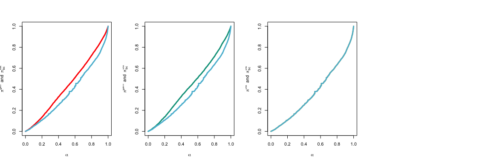<!-- -->

``` r
par(mfrow=c(1,3))
plot(valpha,v_prime_glm-v_prime_bst_bc,type="h",lwd=3,col=clrpal4[4],xlim=c(0,1),ylim=c(-.015,.1),
     xlab=expression(alpha),ylab=expression(pi^glm - pi[bc]^bst))

plot(valpha,v_prime_gam-v_prime_bst_bc,type="h",lwd=3,col=clrpal4[4],xlim=c(0,1),ylim=c(-.015,.1),
     xlab=expression(alpha),ylab=expression(pi^gam - pi[bc]^bst))

plot(valpha,v_prime_bst-v_prime_bst_bc,type="h",lwd=3,col=clrpal4[4],xlim=c(0,1),ylim=c(-.015,.1),
     xlab=expression(alpha),ylab=expression(pi^bst - pi[bc]^bst))
```

<!-- -->

# The models

## Bias correction part on the *validation* dataset

Smoothing is performed using the `locfit` package. In the R function
`locfit`, when `alpha` is given as a single number, it represents a
nearest neighbor fraction (the default smoothing parameter is
. But a second component can be added,
"). That second component represents a
constant bandwidth, and
") will be
computed as follows: as previously,
![k=\[n\\alpha\_0\]](https://latex.codecogs.com/png.latex?k%3D%5Bn%5Calpha_0%5D
"k=[n\\alpha_0]"), and if
}") represents the ordered statistics of
,
=\\max\\{d_{(k)},\\alpha_1\\}"). The default value in R is
`alpha=c(0.7,0)`. As we will see, it might be interesting to consider a
much smaller value.

``` r
vx = seq(0,.2,length=251)
library(locfit)
valid_prime_ref = predict(reg0,newdata=valid_LM_1,type="response")
valid_prime_glm = predict(reg_glm,newdata=valid_LM_1,type="response")
valid_prime_gam = predict(reg_gam,newdata=valid_LM_1,type="response")
valid_prime_bst_30 = as.vector(h2o.predict(object = reg_bst_30, newdata=as.h2o(valid_LM_h2o_1)))
valid_prime_bst_1000 = as.vector(h2o.predict(object = reg_bst_1000, newdata=as.h2o(valid_LM_h2o_1)))
```

Here are crude computations of
bias

``` r
mean(valid_prime_ref)
```

    ## [1] 0.1013432

``` r
sum(final_LM$ClaimNb)/sum(final_LM$Exposure)
```

    ## [1] 0.1003158

``` r
mean(valid_prime_glm)
```

    ## [1] 0.1090698

``` r
mean(predict(reg_glm,newdata=final_LM,type="response"))
```

    ## [1] 0.05357943

``` r
mean(valid_prime_bst_30)
```

    ## [1] 0.08205437

``` r
mean(as.vector(h2o.predict(object = reg_bst_30, newdata=as.h2o(final_LM_h2o))))
```

    ## [1] 0.05277321

``` r
i_valid_prime_glm = valid_prime_glm
i_valid_prime_gam = valid_prime_glm
i_valid_prime_bst_30 = valid_prime_bst_30
i_valid_prime_bst_1000 = valid_prime_bst_1000
```

# Impact of the smoothing parameter 

``` r
VA = seq(.05,.975,by=.025)
comparaison = function(a){
fit_loc_glm = locfit.raw(x=i_valid_prime_glm, 
                 y=valid_LM[,"ClaimNb"]/valid_LM[,"Exposure"], 
                 weights=valid_LM[,"Exposure"], 
                 kern="rect",deg=0,alpha=a)
fit_loc_gam = locfit.raw(x=i_valid_prime_gam, 
                 y=valid_LM[,"ClaimNb"]/valid_LM[,"Exposure"], 
                 weights=valid_LM[,"Exposure"], 
                 kern="rect",deg=0,alpha=a)
fit_loc_bst_30 = locfit.raw(x=i_valid_prime_bst_30, 
                 y=valid_LM[,"ClaimNb"]/valid_LM[,"Exposure"], 
                 weights=valid_LM[,"Exposure"], 
                 kern="rect",deg=0,alpha=a)
fit_loc_bst_1000 = locfit.raw(x=i_valid_prime_bst_1000, 
                 y=valid_LM[,"ClaimNb"]/valid_LM[,"Exposure"], 
                 weights=valid_LM[,"Exposure"], 
                 kern="rect",deg=0,alpha=a)

valid_prime_glm = predict(reg_glm,newdata=final_LM_1,type="response")
valid_prime_gam = predict(reg_gam,newdata=final_LM_1,type="response")
valid_prime_bst_30 = as.vector(h2o.predict(object = reg_bst_30, newdata=as.h2o(final_LM_h2o_1)))
valid_prime_bst_1000 = as.vector(h2o.predict(object = reg_bst_1000, newdata=as.h2o(final_LM_h2o_1)))

p_glm = predict(fit_loc_glm,newdata = valid_prime_glm)
p_gam = predict(fit_loc_gam,newdata = valid_prime_gam)
p_bst_30 = predict(fit_loc_bst_30,newdata = valid_prime_bst_30)
p_bst_1000 = predict(fit_loc_bst_1000,newdata = valid_prime_bst_30)

valid_prime_glm_bc = p_glm
valid_prime_gam_bc = p_gam
valid_prime_bst_30_bc = p_bst_30
valid_prime_bst_1000_bc =  p_bst_1000

y = as.numeric(final_LM$ClaimNb)
w = as.numeric(final_LM$Exposure)
biais = c(mean(valid_prime_glm)-sum(y)/sum(w),
          mean(valid_prime_gam)-sum(y)/sum(w),
          mean(valid_prime_bst_30)-sum(y)/sum(w),
          mean(valid_prime_bst_1000)-sum(y)/sum(w),
          mean(valid_prime_glm)-sum(y)/sum(w),
          mean(valid_prime_gam)-sum(y)/sum(w),
          mean(valid_prime_bst_30_bc)-sum(y)/sum(w),
          mean(valid_prime_bst_1000_bc)-sum(y)/sum(w))
names(biais) = c("glm","gam","bst30","bst1000",
                 "glmbc","gambc","bst30bc","bst1000bc")
poissonloss = function(u,v,e) weighted.mean(u-v/e*log(u),e)
ploss = c(poissonloss(valid_prime_glm,y,w),
          poissonloss(valid_prime_gam,y,w),
          poissonloss(valid_prime_bst_30,y,w),
          poissonloss(valid_prime_bst_1000,y,w),
          poissonloss(valid_prime_glm_bc,y,w),
          poissonloss(valid_prime_gam_bc,y,w),
          poissonloss(valid_prime_bst_30_bc,y,w),
          poissonloss(valid_prime_bst_1000_bc,y,w))
names(ploss) = c("glm","gam","bst30","bst1000",
                 "glmbc","gambc","bst30bc","bst1000bc")
mseloss = function(u,v,e) weighted.mean((u-v/e)^2,e)
loss2 = c(mseloss(valid_prime_glm,y,w),
          mseloss(valid_prime_gam,y,w),
          mseloss(valid_prime_bst_30,y,w),
          mseloss(valid_prime_bst_1000,y,w),
          mseloss(valid_prime_glm_bc,y,w),
          mseloss(valid_prime_gam_bc,y,w),
          mseloss(valid_prime_bst_30_bc,y,w),
          mseloss(valid_prime_bst_1000_bc,y,w))
names(loss2) = c("glm","gam","bst30","bst1000",
                 "glmbc","gambc","bst30bc","bst1000bc")
return(list(alpha = a,
            bias = biais,
            poisson = ploss,
            mse = loss2))
}
```

In order to visualize the impact of
, let
us try several values

``` r
B=P=M =matrix(NA,length(VA),(2+2)*2+1)
for(t in 1:length(VA)){
  L = comparaison(VA[t])
  B[t,]=c(L$alpha,L$bias)
  P[t,]=c(L$alpha,L$poisson)
  M[t,]=c(L$alpha,L$mse)
}
colnames(B)=colnames(P)=colnames(M)=c("alpha","glm","gam","bst30","bst1000","glmbc","gambc","bst30bc","bst1000bc")
```

``` r
par(mfrow=c(2,2))
plot(P[,1],B[,"glm"],type="l",lwd=1,ylim=range(B[,2:ncol(B)]),col=scales::alpha(clrpal6[1],.5),xlim=c(-.065,1.1),xlab=expression(alpha),ylab="Bias")
abline(h=0,lwd=.4)
lines(P[,1],B[,"gam"],type="l",lwd=1,col=scales::alpha(clrpal6[2],.5))
lines(P[,1],B[,"bst30"],type="l",lwd=1,col=scales::alpha(clrpal6[3],.5))
lines(P[,1],B[,"bst1000"],type="l",lwd=1,col=scales::alpha(clrpal6[6],.5))
text(.975,B[1,"glm"]-.0002,"GLM",col=clrpal6[1],pos=4,cex=.7)
text(.975,B[1,"gam"]+.0002,"GAM",col=clrpal6[2],pos=4,cex=.7)
text(.975,B[1,"bst30"],"BST-30",col=clrpal6[3],pos=4,cex=.7)
text(.975,B[1,"bst1000"],"BST-1000",col=clrpal6[6],pos=4,cex=.7)
lines(P[,1],B[,"glmbc"],type="l",lwd=2,col=clrpal6[1])
lines(P[,1],B[,"gambc"],type="l",lwd=2,col=clrpal6[2])
lines(P[,1],B[,"bst30bc"],type="l",lwd=2,col=clrpal6[3])
lines(P[,1],B[,"bst1000bc"],type="l",lwd=2,col=clrpal6[6])
text(.05,B[1,"glmbc"]-.0002,expression(GLM[BC]),col=clrpal6[1],pos=2,cex=.7)
text(.05,B[1,"gambc"]+.0002,expression(GAM[BC]),col=clrpal6[2],pos=2,cex=.7)
text(.05,B[1,"bst30bc"],expression(BST[BC]-30),col=clrpal6[3],pos=2,cex=.7)
text(.05,B[1,"bst1000bc"]-.0005,expression(BST[BC]-1000),col=clrpal6[6],pos=2,cex=.7)

plot(P[,1],P[,"glm"],type="l",lwd=1,ylim=range(P[,2:ncol(B)]),col=scales::alpha(clrpal6[1],.5),xlim=c(-.05,1.1),xlab=expression(alpha),ylab="Poisson loss")
abline(h=0,lwd=.4)
lines(P[,1],P[,"gam"],type="l",lwd=1,col=scales::alpha(clrpal6[2],.5))
lines(P[,1],P[,"bst30"],type="l",lwd=1,col=scales::alpha(clrpal6[3],.5))
lines(P[,1],P[,"bst1000"],type="l",lwd=1,col=scales::alpha(clrpal6[6],.5))
text(.975,P[1,"glm"]+.0005,"GLM",col=clrpal6[1],pos=4,cex=.7)
text(.975,P[1,"gam"]-.0005,"GAM",col=clrpal6[2],pos=4,cex=.7)
text(.975,P[1,"bst30"]+.0005,"BST-30",col=clrpal6[3],pos=4,cex=.7)
text(.975,P[1,"bst1000"]-.0005,"BST-1000",col=clrpal6[6],pos=4,cex=.7)
lines(P[,1],P[,"glmbc"],type="l",lwd=2,col=clrpal6[1])
lines(P[,1],P[,"gambc"],type="l",lwd=2,col=clrpal6[2])
lines(P[,1],P[,"bst30bc"],type="l",lwd=2,col=clrpal6[3])
lines(P[,1],P[,"bst1000bc"],type="l",lwd=2,col=clrpal6[6])
text(.05,P[1,"glmbc"]+.0005,expression(GLM[BC]),col=clrpal6[1],pos=2,cex=.7)
text(.05,P[1,"gambc"]-.0005,expression(GAM[BC]),col=clrpal6[2],pos=2,cex=.7)
text(.05,P[1,"bst30bc"],expression(BST[BC]-30),col=clrpal6[3],pos=2,cex=.7)
text(.05,P[1,"bst1000bc"]-.0005,expression(BST[BC]-1000),col=clrpal6[6],pos=2,cex=.7)

plot(B[,"glmbc"],P[,"glmbc"],type="l",lwd=2,col=clrpal6[1],ylim=range(P[,6:9]),xlim=c(min(B[,6:0])-.002,max(B[,6:9])),xlab="Bias", ylab="Poisson loss")
abline(v=0,lwd=.4)
lines(B[,"gambc"],P[,"gambc"],type="l",lwd=2,col=clrpal6[2])
lines(B[,"bst30bc"],P[,"bst30bc"],type="l",lwd=2,col=clrpal6[3])
lines(B[,"bst1000bc"],P[,"bst1000bc"],type="l",lwd=2,col=clrpal6[6])
idx=which((B[,1]*100)%%10<.01)
text(B[idx,"bst30bc"],P[idx,"bst1000bc"],paste(B[idx,1]*100,"%"),col=clrpal6[6],cex=.7,pos=2)

plot(P[,1],M[,"glm"],type="l",lwd=1,ylim=range(M[,2:ncol(B)]),col=scales::alpha(clrpal6[1],.5),xlim=c(-.05,1.1),xlab=expression(alpha),ylab="Mean Squared Error")
abline(h=0,lwd=.4)
lines(P[,1],M[,"gam"],type="l",lwd=1,col=scales::alpha(clrpal6[2],.5))
lines(P[,1],M[,"bst30"],type="l",lwd=1,col=scales::alpha(clrpal6[3],.5))
lines(P[,1],M[,"bst1000"],type="l",lwd=1,col=scales::alpha(clrpal6[6],.5))
text(.975,M[1,"glm"]+.0005,"GLM",col=clrpal6[1],pos=4,cex=.7)
text(.975,M[1,"gam"]-.0005,"GAM",col=clrpal6[2],pos=4,cex=.7)
text(.975,M[1,"bst30"],"BST-30",col=clrpal6[3],pos=4,cex=.7)
text(.975,M[1,"bst1000"],"BST-1000",col=clrpal6[6],pos=4,cex=.7)
lines(P[,1],M[,"glmbc"],type="l",lwd=2,col=clrpal6[1])
lines(P[,1],M[,"gambc"],type="l",lwd=2,col=clrpal6[2])
lines(P[,1],M[,"bst30bc"],type="l",lwd=2,col=clrpal6[3])
lines(P[,1],M[,"bst1000bc"],type="l",lwd=2,col=clrpal6[6])
text(.05,M[1,"glmbc"]+.0005,expression(GLM[BC]),col=clrpal6[1],pos=2,cex=.7)
text(.05,M[1,"gambc"]-.0005,expression(GAM[BC]),col=clrpal6[2],pos=2,cex=.7)
text(.05,M[1,"bst30bc"],expression(BST[BC]-30),col=clrpal6[3],pos=2,cex=.7)
text(.05,M[1,"bst1000bc"]-.0005,expression(BST[BC]-1000),col=clrpal6[6],pos=2,cex=.7)
```

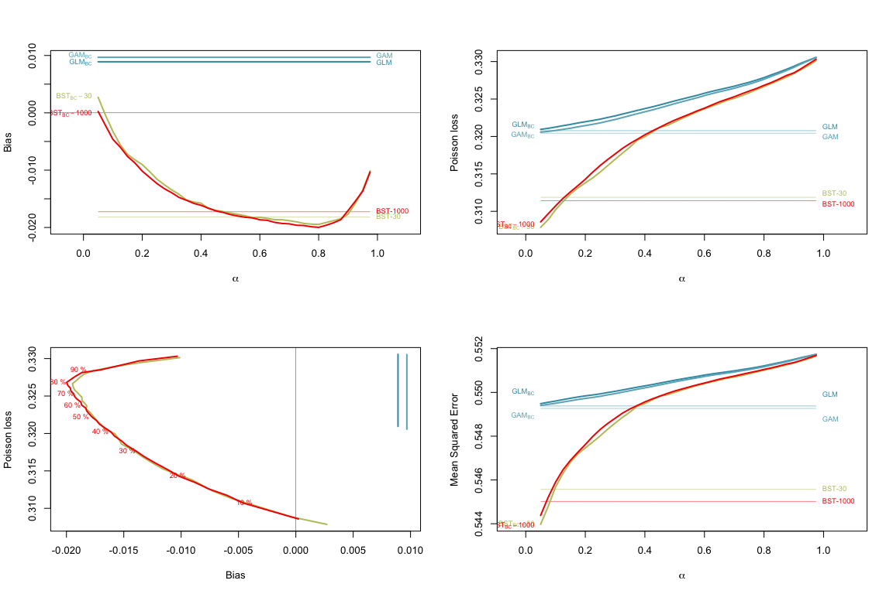<!-- -->

``` r
par(mfrow=c(1,3))
clrpal6 = rep(NA,6)
clrpal6[c(1,2,3,6)] = wes_palette("Darjeeling1")[c(1,2,3,5)]
plot(P[,1],B[,"glm"],type="l",lwd=1,ylim=range(B[,2:ncol(B)]),col=scales::alpha(clrpal6[1],.5),xlim=c(0,1),xlab=expression(alpha),ylab="Bias")
abline(h=0,lwd=.4)
lines(P[,1],B[,"gam"],type="l",lwd=1,col=scales::alpha(clrpal6[2],.5))
lines(P[,1],B[,"bst30"],type="l",lwd=1,col=scales::alpha(clrpal6[3],.5))
lines(P[,1],B[,"bst1000"],type="l",lwd=1,col=scales::alpha(clrpal6[6],.5))
lines(P[,1],B[,"glmbc"],type="l",lwd=2,col=clrpal6[1])
lines(P[,1],B[,"gambc"],type="l",lwd=2,col=clrpal6[2])
lines(P[,1],B[,"bst30bc"],type="l",lwd=2,col=clrpal6[3])
lines(P[,1],B[,"bst1000bc"],type="l",lwd=2,col=clrpal6[6])

plot(P[,1],P[,2],type="l",lwd=1,ylim=range(P[,2:ncol(B)]),col=scales::alpha(clrpal6[1],.5),xlim=c(0,1),xlab=expression(alpha),ylab="Poisson loss")
lines(P[,1],P[,"gam"],type="l",lwd=1,col=scales::alpha(clrpal6[2],.5))
lines(P[,1],P[,"bst30"],type="l",lwd=1,col=scales::alpha(clrpal6[3],.5))
lines(P[,1],P[,"bst1000"],type="l",lwd=1,col=scales::alpha(clrpal6[6],.5))
lines(P[,1],P[,"glmbc"],type="l",lwd=2,col=clrpal6[1])
lines(P[,1],P[,"gambc"],type="l",lwd=2,col=clrpal6[2])
lines(P[,1],P[,"bst30bc"],type="l",lwd=2,col=clrpal6[3])
lines(P[,1],P[,"bst1000bc"],type="l",lwd=2,col=clrpal6[6])

plot(B[,"glmbc"],P[,"glmbc"],type="l",lwd=2,col=clrpal6[1],ylim=range(P[,6:9]),xlim=c(min(B[,6:9])-.002,max(B[,6:9])),xlab="Bias", ylab="Poisson loss")
abline(v=0,lwd=.4)
lines(B[,"gambc"],P[,"gambc"],type="l",lwd=2,col=clrpal6[2])
lines(B[,"bst30bc"],P[,"bst30bc"],type="l",lwd=2,col=clrpal6[3])
lines(B[,"bst1000bc"],P[,"bst1000bc"],type="l",lwd=2,col=clrpal6[6])
idx=which((B[,1]*100)%%10<.01)
text(B[idx,"bst30bc"],P[idx,"bst1000bc"],paste(B[idx,1]*100,"%"),col=clrpal6[6],cex=.7,pos=2)
```

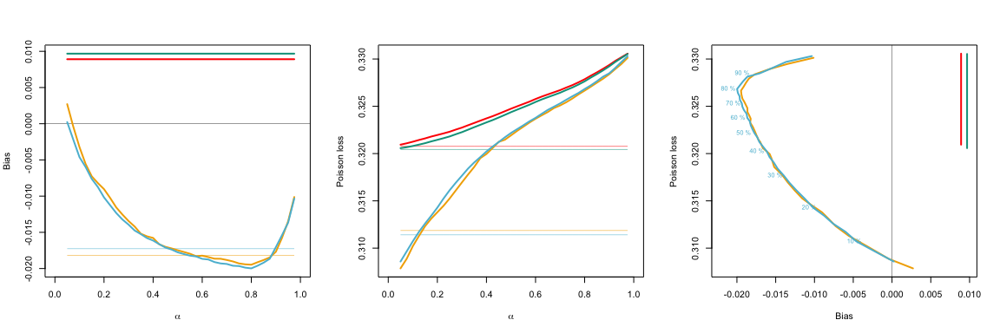<!-- -->

Autocalibration, application on real data (Tweedie)
================

# Dataset and other parameters

First, let us define a color palette for graphs

``` r
library("wesanderson")
library(scales)
clrpal = wes_palette("Zissou1", 22, type = "continuous")
clrpallow = scales::alpha(clrpal,.4)
bleurouge = clrpal[c(1,22)]
bleurougepal = clrpallow[c(1,22)]
colr= clrpal4 = wes_palette("Darjeeling1")[c(1,2,3,5)]
clrpal6 = wes_palette("Zissou1", 6, type = "continuous")
```

The dataset we will use is `freMTPL2freq` from the `CASdatasets` package
(see <http://cas.uqam.ca>),

``` r
library(CASdatasets)
data("freMTPL2freq")
data("freMTPL2sev")
str(freMTPL2sev)
```

    ## 'data.frame':    26639 obs. of  2 variables:
    ##  $ IDpol      : int  1552 1010996 4024277 4007252 4046424 4073956 4012173 4020812 4020812 4074074 ...
    ##  $ ClaimAmount: num  995 1128 1851 1204 1204 ...

``` r
freMTPL2sev_tot = aggregate(freMTPL2sev$ClaimAmount,
                            by=list(freMTPL2sev$IDpol),
                            FUN = sum)
names(freMTPL2sev_tot)=names(freMTPL2sev)
freMTPL2 = merge(freMTPL2freq,freMTPL2sev_tot,all.x=TRUE)
freMTPL2$ClaimAmount[is.na(freMTPL2$ClaimAmount)]=0

freMTPL2 = freMTPL2[(freMTPL2$Exposure>.95)&(freMTPL2$Exposure<1.05),]

freMTPL2_backup = freMTPL2

set.seed(123)
TAUX = c(.6,.2)
idx_train = sample(1:nrow(freMTPL2),size = round(nrow(freMTPL2)*TAUX[1]))
idx_reste = (1:nrow(freMTPL2))[-idx_train]
idx_correct = sample(idx_reste,size = round(nrow(freMTPL2)*TAUX[2]))
idx_final = (1:nrow(freMTPL2))[-c(idx_train,idx_correct)]
```

``` r
dev = function(p){
reg = glm(ClaimAmount ~ VehAge+VehPower+VehBrand+as.factor(VehGas)+
                 Area+Density+Region+DrivAge+BonusMalus+
                 offset(log(Exposure)), data=freMTPL2[idx_train,],
          family=tweedie(var.power = p, link.power = 0))
reg$deviance
}
```

``` r
vect_p = vect_dev = seq(1.15,1.66,by=.005)
for(i in 1:length(vect_p)){vect_dev[i]=dev(vect_p[i])}
```

``` r
pw = 1.6
par(mfrow=c(1,3))
plot(vect_p,vect_dev,type="l",xlab="Power",ylab="Deviance (GLM)" )
abline(v=pw,col=colr[2])
```

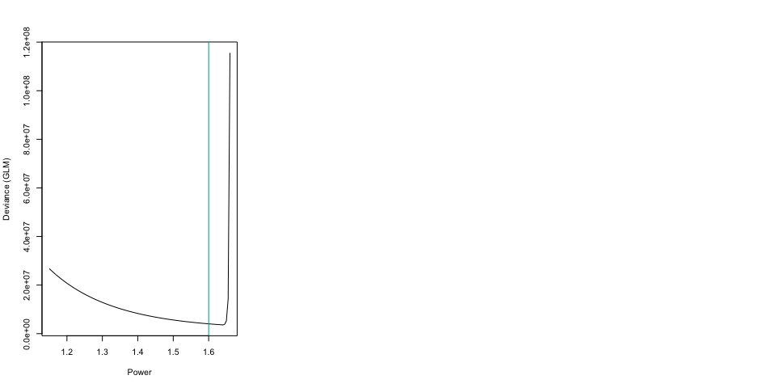<!-- -->

# GLM and GAM with Tweedie Loss

``` r
reg_glm = glm(ClaimAmount ~ VehAge+VehPower+VehBrand+as.factor(VehGas)+
                 Area+Density+Region+DrivAge+BonusMalus+
                 offset(log(Exposure)),
          data=freMTPL2[idx_train,],
          family=tweedie(var.power = pw, link.power = 0))
library(splines)
reg_gam = glm(ClaimAmount ~ bs(VehAge)+bs(VehPower)+VehBrand+as.factor(VehGas)+
                 Area+bs(Density)+Region+bs(DrivAge)+bs(BonusMalus)+
                 offset(log(Exposure)),
          data=freMTPL2[idx_train,],
          family=tweedie(var.power = pw, link.power = 0))


predict_glm=predict(reg_glm,type="response",newdata=freMTPL2[idx_correct,])
predict_gam=predict(reg_gam,type="response",newdata=freMTPL2[idx_correct,])
```

    ## Warning in bs(BonusMalus, degree = 3L, knots = numeric(0), Boundary.knots =
    ## c(50L, : some 'x' values beyond boundary knots may cause ill-conditioned bases

``` r
library(locfit)
fit_loc_1 = locfit.raw(x=predict_glm, 
                         y=freMTPL2[idx_correct,"ClaimAmount"], 
                         kern="rect",deg=0,alpha=.05)
fit_loc_2 = locfit.raw(x=predict_gam, 
                         y=freMTPL2[idx_correct,"ClaimAmount"], 
                         kern="rect",deg=0,alpha=.05)
```

# Boosting with Tweedie Loss

``` r
library(TDboost)
library(HDtweedie) # has example dataset
library(dplyr)
```

    ## 
    ## Attaching package: 'dplyr'

    ## The following objects are masked from 'package:xts':
    ## 
    ##     first, last

    ## The following objects are masked from 'package:stats':
    ## 
    ##     filter, lag

    ## The following objects are masked from 'package:base':
    ## 
    ##     intersect, setdiff, setequal, union

``` r
fit = TDboost(ClaimAmount ~ VehAge+VehPower+VehBrand+as.factor(VehGas)+
                 Area+Density+Region+DrivAge+BonusMalus+
                 offset(log(Exposure)),
              data=freMTPL2[idx_train,],
              cv.folds=5, n.trees=3000, interaction.depth = 20)
```

    ## CV: 1 
    ## Iter   TrainDeviance   ValidDeviance   StepSize   Improve
    ##      1       36.5857         34.6752     0.0010    0.0039
    ##      2       36.5791         34.6703     0.0010    0.0046
    ##      3       36.5719         34.6654     0.0010    0.0039
    ##    ...

``` r
best.iter <- TDboost.perf(fit, method="test")
best.iter <- TDboost.perf(fit, method="cv")
```

<!-- -->

``` r
predict_bst=predict.TDboost(fit, freMTPL2[idx_correct,], best.iter)
```

    ## Warning in predict.TDboost(fit, freMTPL2[idx_correct, ], best.iter):
    ## predict.TDboost does not add the offset to the predicted values.

``` r
fit_loc_3 = locfit.raw(x=predict_bst, 
                         y=freMTPL2[idx_correct,"ClaimAmount"],
                         kern="rect",deg=0,alpha=.05)
```

The figure below is the distribution of the premiums according to the
three models

``` r
par(mfrow=c(1,4))
hist(predict_glm, breaks = seq(0,max(predict_glm)+10,by=5),xlim=c(0,300),col=clrpal4[1],border="white",
     main="",xlab="Premium (GLM)",ylab="",ylim=c(0,5000))
hist(predict_gam, breaks = seq(0,max(predict_gam)+10,by=5),xlim=c(0,300),col=clrpal4[2],border="white",
     main="",xlab="Premium (GAM)",ylab="",ylim=c(0,5000))
hist(predict_bst, breaks = seq(0,max(predict_bst)+10,by=5),xlim=c(0,300),col=clrpal4[3],border="white",
     main="",xlab="Premium (boosting)",ylab="",ylim=c(0,5000))
exc = c(mean(predict_glm>300),mean(predict_gam>300),mean(predict_bst>300))
names(exc)=c("glm","gam","bst")
```

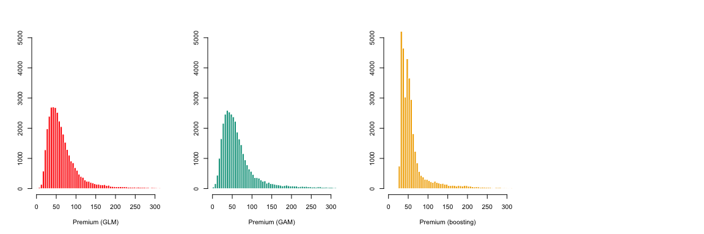<!-- -->

``` r
par(mfrow=c(1,3))
plot(fit_loc_1,lwd=3,col=clrpal4[1],xlim=c(0,300),xlab="Premium (GLM)",ylab="",ylim=c(0,300))
abline(a=0,b=1,lwd=.4)
plot(fit_loc_2,lwd=3,col=clrpal4[2],xlim=c(0,300),xlab="Premium (GAM)",ylab="",ylim=c(0,300))
abline(a=0,b=1,lwd=.4)
plot(fit_loc_3,lwd=3,col=clrpal4[3],xlim=c(0,300),xlab="Premium (Boosting)",ylab="",ylim=c(0,300))
abline(a=0,b=1,lwd=.4)
```

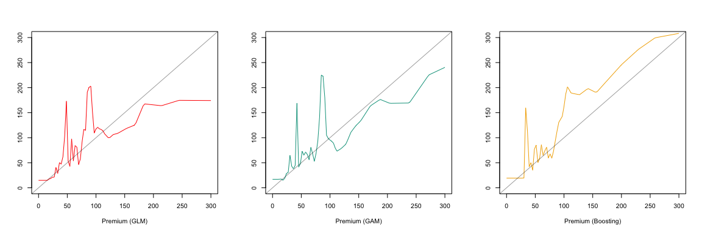<!-- -->

# Removing \`large’ claims

``` r
pict_correc = function(claims_limit = 1000, pw = 1.66){
  freMTPL2 = freMTPL2_backup
freMTPL2 = freMTPL2[freMTPL2$ClaimAmount<=claims_limit,]
set.seed(123)
TAUX = c(.6,.2)
idx_train = sample(1:nrow(freMTPL2),size = round(nrow(freMTPL2)*TAUX[1]))
idx_reste = (1:nrow(freMTPL2))[-idx_train]
idx_correct = sample(idx_reste,size = round(nrow(freMTPL2)*TAUX[2]))
idx_final = (1:nrow(freMTPL2))[-c(idx_train,idx_correct)]

reg_glm = glm(ClaimAmount ~ VehAge+VehPower+VehBrand+as.factor(VehGas)+
                 Area+Density+Region+DrivAge+BonusMalus+
                 offset(log(Exposure)),
          data=freMTPL2[idx_train,],
          family=tweedie(var.power = pw, link.power = 0))
library(splines)
reg_gam = glm(ClaimAmount ~ bs(VehAge)+bs(VehPower)+VehBrand+as.factor(VehGas)+
                 Area+bs(Density)+Region+bs(DrivAge)+bs(BonusMalus)+
                 offset(log(Exposure)),
          data=freMTPL2[idx_train,],
          family=tweedie(var.power = pw, link.power = 0))
predict_glm=predict(reg_glm,type="response",newdata=freMTPL2[idx_correct,])
predict_gam=predict(reg_gam,type="response",newdata=freMTPL2[idx_correct,])
library(locfit)
fit_loc_1 = locfit.raw(x=predict_glm, 
                         y=freMTPL2[idx_correct,"ClaimAmount"], 
                         kern="rect",deg=0,alpha=.05)
fit_loc_2 = locfit.raw(x=predict_gam, 
                         y=freMTPL2[idx_correct,"ClaimAmount"], 
                         kern="rect",deg=0,alpha=.05)

fit = TDboost(ClaimAmount ~ VehAge+VehPower+VehBrand+as.factor(VehGas)+
                 Area+Density+Region+DrivAge+BonusMalus+
                 offset(log(Exposure)),
              data=freMTPL2[idx_train,],
              cv.folds=5, n.trees=3000, interaction.depth = 20)

best.iter <- TDboost.perf(fit, method="test")
best.iter <- TDboost.perf(fit, method="cv")
predict_bst=predict.TDboost(fit, freMTPL2[idx_correct,], best.iter)
fit_loc_3 = locfit.raw(x=predict_bst, 
                         y=freMTPL2[idx_correct,"ClaimAmount"],
                         kern="rect",deg=0,alpha=.05)
par(mfrow=c(1,3))
plot(fit_loc_1,lwd=3,col=clrpal4[1],xlim=c(0,300),xlab="Premium (GLM)",ylab="",ylim=c(0,300))
abline(a=0,b=1,lwd=.4)
plot(fit_loc_2,lwd=3,col=clrpal4[2],xlim=c(0,300),xlab="Premium (GAM)",ylab="",ylim=c(0,300))
abline(a=0,b=1,lwd=.4)
plot(fit_loc_3,lwd=3,col=clrpal4[3],xlim=c(0,300),xlab="Premium (Boosting)",ylab="",ylim=c(0,300))
abline(a=0,b=1,lwd=.4)
}
x = sort(freMTPL2_backup$ClaimAmount)
n = length(x)
a = mean(x==0)
x2 = sort(x[x>0])
n2 = length(x2)

par(mfrow=c(1,3))
plot(x,(1:n)/(n+1),type="s",col=colr[1],xlab="Claim size",ylab="Proportion (%)")
plot(x2,a+(1:n2)/(n+1),type="s",col=colr[2],xlab="Claim size",ylab="Proporti on (%)",ylim=c(a,1))
plot(x2,a+(1:n2)/(n+1),type="s",col=colr[4],xlab="Claim size",ylab="Proportion (%)",ylim=c(a,1),log="x")
```

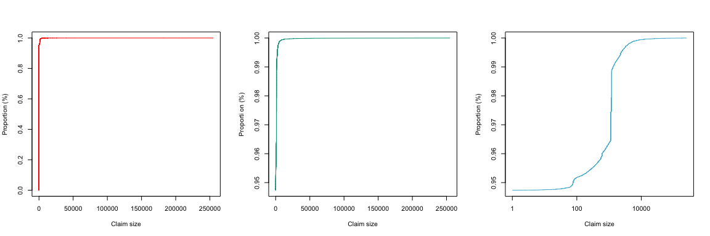<!-- -->

``` r
mean(x>10000)
```

    ## [1] 0.0005389625

``` r
mean(x[x>0]>10000)
```

    ## [1] 0.01024109

``` r
pict_correc(claims_limit = 10000, pw = 1.6)
```

    ## CV: 1 
    ## Iter   TrainDeviance   ValidDeviance   StepSize   Improve
    ##      1       32.2711         32.5332     0.0010    0.0040
    ##      2       32.2672         32.5299     0.0010    0.0034
    ##      3       32.2633         32.5265     0.0010    0.0034
    ##    ...

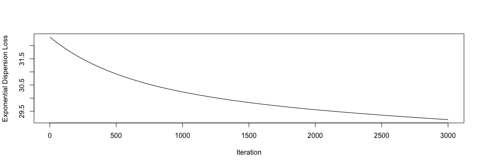<!-- -->

    ## Warning in predict.TDboost(fit, freMTPL2[idx_correct, ], best.iter):
    ## predict.TDboost does not add the offset to the predicted values.

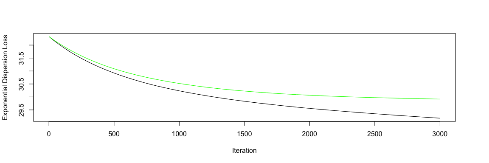<!-- -->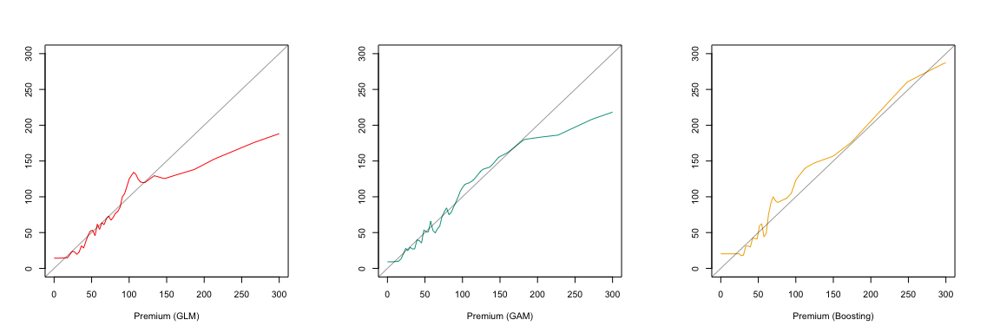<!-- -->

``` r
pict_correc(claims_limit = Inf, pw = 1.5)
```

    ## Warning in bs(BonusMalus, degree = 3L, knots = numeric(0), Boundary.knots =
    ## c(50L, : some 'x' values beyond boundary knots may cause ill-conditioned bases

    ## CV: 1 
    ## Iter   TrainDeviance   ValidDeviance   StepSize   Improve
    ##      1       36.5857         34.6752     0.0010    0.0039
    ##      2       36.5791         34.6703     0.0010    0.0046
    ##      3       36.5719         34.6654     0.0010    0.0039
    ##    ...

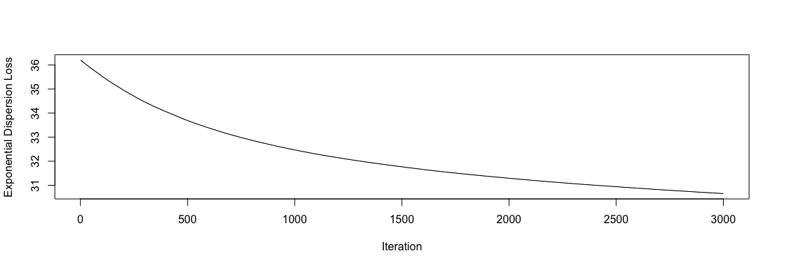<!-- -->

    ## Warning in predict.TDboost(fit, freMTPL2[idx_correct, ], best.iter):
    ## predict.TDboost does not add the offset to the predicted values.

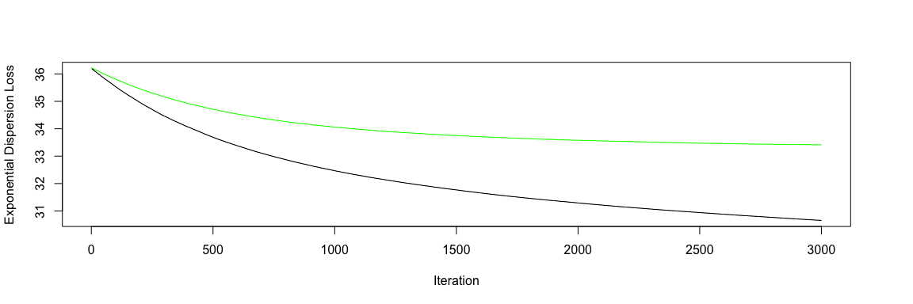<!-- -->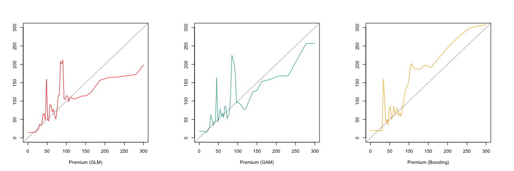<!-- -->

``` r
pict_correc(claims_limit = Inf, pw = 1.4)
```

    ## Warning in bs(BonusMalus, degree = 3L, knots = numeric(0), Boundary.knots =
    ## c(50L, : some 'x' values beyond boundary knots may cause ill-conditioned bases

    ## CV: 1 
    ## Iter   TrainDeviance   ValidDeviance   StepSize   Improve
    ##      1       36.5857         34.6752     0.0010    0.0039
    ##      2       36.5791         34.6703     0.0010    0.0046
    ##      3       36.5719         34.6654     0.0010    0.0039
    ##    ...
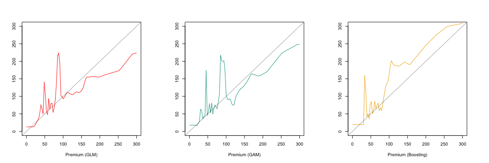<!-- -->

