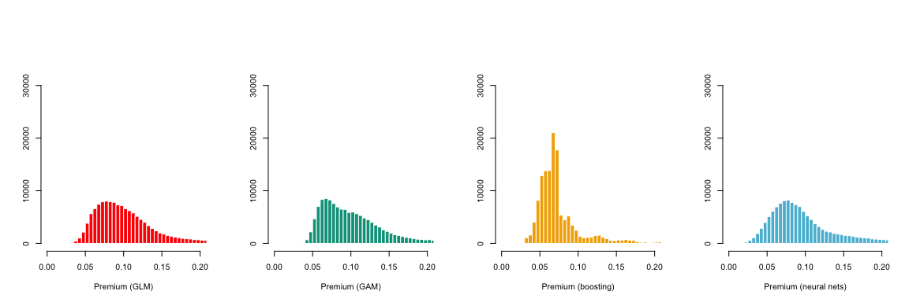
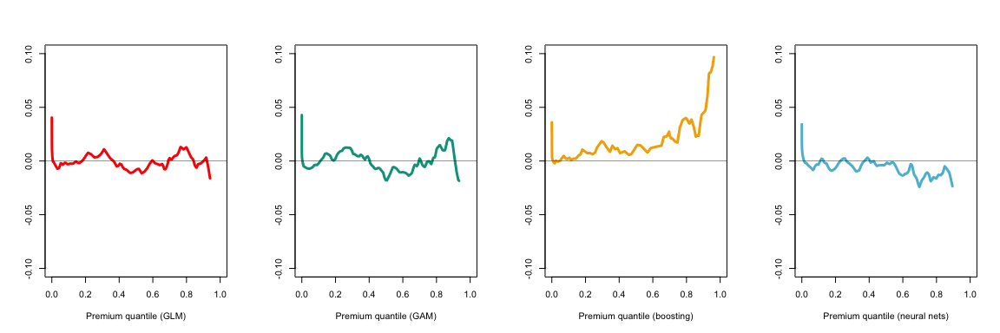
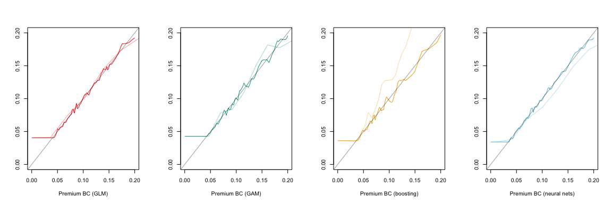
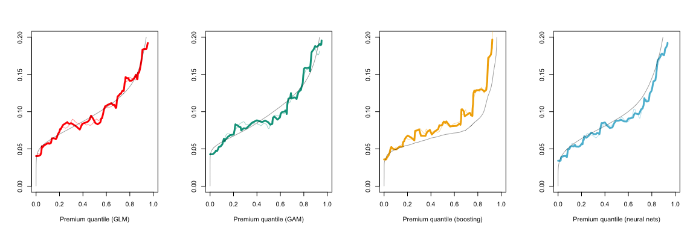
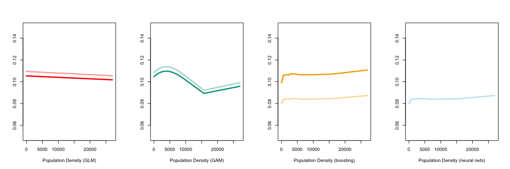

Autocalibration, application on real data
================
Arthur Charpentier, Michel Denuit & Julien Trufin
05/03/2021

This github repository is based on the paper

Michel Denuit, Arthur Charpentier & Julien Trufin (2021)
**Autocalibration and Tweedie-dominance for Insurance Pricing with
Machine Learning** [https://arxiv.org/abs/2103.03635](ArXiv:2103.03635)

Here are the codes used to produce the figures in section 6.

# Dataset and other parameters

First, let us define a color palette for graphs

``` r
library("wesanderson")
library(scales)
clrpal = wes_palette("Zissou1", 22, type = "continuous")
clrpallow = scales::alpha(clrpal,.4)
bleurouge = clrpal[c(1,22)]
bleurougepal = clrpallow[c(1,22)]
clrpal4 = wes_palette("Darjeeling1")[c(1,2,3,5)]
clrpal6 = wes_palette("Zissou1", 6, type = "continuous")
```

The dataset we will use is `freMTPL2freq` from the `CASdatasets` package
(see <http://cas.uqam.ca>),

``` r
library(CASdatasets)
data(freMTPL2freq)
str(freMTPL2freq)
```

    ## 'data.frame':    678013 obs. of  12 variables:
    ##  $ IDpol     : num  1 3 5 10 11 13 15 17 18 21 ...
    ##  $ ClaimNb   : 'table' num [1:678013(1d)] 1 1 1 1 1 1 1 1 1 1 ...
    ##  $ Exposure  : num  0.1 0.77 0.75 0.09 0.84 0.52 0.45 0.27 0.71 0.15 ...
    ##  $ VehPower  : int  5 5 6 7 7 6 6 7 7 7 ...
    ##  $ VehAge    : int  0 0 2 0 0 2 2 0 0 0 ...
    ##  $ DrivAge   : int  55 55 52 46 46 38 38 33 33 41 ...
    ##  $ BonusMalus: int  50 50 50 50 50 50 50 68 68 50 ...
    ##  $ VehBrand  : Factor w/ 11 levels "B1","B10","B11",..: 4 4 4 4 4 4 4 4 4 4 ...
    ##  $ VehGas    : chr  "Regular" "Regular" "Diesel" "Diesel" ...
    ##  $ Area      : Factor w/ 6 levels "A","B","C","D",..: 4 4 2 2 2 5 5 3 3 2 ...
    ##  $ Density   : int  1217 1217 54 76 76 3003 3003 137 137 60 ...
    ##  $ Region    : Factor w/ 21 levels "Alsace","Aquitaine",..: 21 21 18 2 2 16 16 13 13 17 ...

For the *boosting* algorithm, we will use the `h2o` package

``` r
library(h2o)
#h2o.shutdown(prompt = TRUE)
h2o.init(nthreads = -1)
```

    ##  Connection successful!
    ## 
    ## R is connected to the H2O cluster: 
    ##     H2O cluster uptime:         1 hours 22 minutes 
    ##     H2O cluster timezone:       America/Toronto 
    ##     H2O data parsing timezone:  UTC 
    ##     H2O cluster version:        3.32.0.3 
    ##     H2O cluster version age:    2 months and 14 days  
    ##     H2O cluster name:           H2O_started_from_R_acharpen_xtn957 
    ##     H2O cluster total nodes:    1 
    ##     H2O cluster total memory:   3.44 GB 
    ##     H2O cluster total cores:    4 
    ##     H2O cluster allowed cores:  4 
    ##     H2O cluster healthy:        TRUE 
    ##     H2O Connection ip:          localhost 
    ##     H2O Connection port:        54321 
    ##     H2O Connection proxy:       NA 
    ##     H2O Internal Security:      FALSE 
    ##     H2O API Extensions:         Amazon S3, XGBoost, Algos, AutoML, Core V3, TargetEncoder, Core V4 
    ##     R Version:                  R version 3.6.3 (2020-02-29)

``` r
h2o.no_progress()
```

In that package, inputs are matrices, so we have to expand factor
variables into indicators (using
`model.matrix`),

``` r
LM = model.matrix(ClaimNb ~ VehPower+VehAge+DrivAge+BonusMalus+VehBrand+Area+Density+Region+VehGas+Exposure, data=freMTPL2freq)
LM = cbind(ClaimNb=freMTPL2freq$ClaimNb,LM)
LM = as.data.frame(LM)
```

We create three subsets

  - a training dataset, `train_LM` (or `train_LM_h2o` to consider
    categorical variables as a collection of indicators), here with 60%
    of the observations
  - a validation dataset, `valid_LM` (or `validation_LM_h2o` to consider
    categorical variables as a collection of indicators), here with 20%
    of the observations, used for the model bias correction
  - a final dataset, `final_LM` (or `final_LM_h2o` to consider
    categorical variables as a collection of indicators), here with 20%
    of the observations, for tests

<!-- end list -->

``` r
set.seed(123)
TAUX = c(.6,.2)
idx_train = sample(1:nrow(LM),size = round(nrow(LM)*TAUX[1]))
idx_reste = (1:nrow(LM))[-idx_train]
idx_correct = sample(idx_reste,size = round(nrow(LM)*TAUX[2]))
idx_final = (1:nrow(LM))[-c(idx_train,idx_correct)]
train_LM_h2o = as.h2o(LM[idx_train,])
valid_LM_h2o = as.h2o(LM[idx_correct,])
final_LM_h2o = as.h2o(LM[idx_final,])
train_LM = freMTPL2freq[idx_train,]
valid_LM = freMTPL2freq[idx_correct,]
final_LM = freMTPL2freq[idx_final,]
valid_LM_1 = valid_LM 
valid_LM_1$Exposure =1
valid_LM_h2o_1 = valid_LM_h2o
valid_LM_h2o_1$Exposure =1
final_LM_1 = final_LM 
final_LM_1$Exposure =1
final_LM_h2o_1 = final_LM_h2o
final_LM_h2o_1$Exposure =1
```

On the validation and testing datasets, a copy is created with a unit
exposure (variable `Exposure`).

# Models (GLM, GAM and Boosting)

## Learning on the *training* datasets

We create three linear models

  - `reg0` which is a Poisson regression on the intercept, only (to have
    a benchmark)
  - `reg_glm` which is a Poisson regression
  - `reg_0_gam` which is a Poisson regression with smooth (splines)
    transformation of continuous covariates

<!-- end list -->

``` r
library(splines)
reg0 = glm(ClaimNb~1+offset(log(Exposure)),family=poisson,data=train_LM)
reg_glm = glm(ClaimNb~VehPower+VehAge+DrivAge+BonusMalus+Density+VehBrand+VehGas+Area+Region+offset(log(Exposure)),family=poisson,data=train_LM)
reg_gam = glm(ClaimNb~bs(VehPower)+bs(VehAge)+bs(DrivAge)+bs(BonusMalus)+bs(Density)+VehBrand+VehGas+Area+Region+offset(log(Exposure)),family=poisson,data=train_LM)
```

The we run two boosting algorithms, one with 30 trees, and one with 1000
trees

``` r
reg_bst_30 = h2o.gbm(y = "ClaimNb", x = names(LM)[3:43],
                       distribution = "poisson",
                       offset_column = "Exposure",
                       training_frame = train_LM_h2o,
                       validation_frame = valid_LM_h2o,
                       ntrees = 30,
                       nfolds = 5,
                       seed = 1)
reg_bst_1000 = h2o.gbm(y = "ClaimNb", x = names(LM)[3:43],
                       distribution = "poisson",
                       offset_column = "Exposure",
                       training_frame = train_LM_h2o,
                       validation_frame = valid_LM_h2o,
                       ntrees = 1000,
                       nfolds = 5,
                       seed = 1)
reg_bst = reg_bst_30
```

Here is the cross-validation loss

``` r
plot(reg_bst_1000)
```

<!-- -->

# Construction of the models

Let \(\mu\) denote the true mean,
\(\mu(\boldsymbol{x})=\mathbb{E}[Y|\boldsymbol{X}=\boldsymbol{x}]\).

``` r
vx = seq(0,.2,length=251)
library(locfit)
valid_prime_glm = predict(reg_glm,newdata=valid_LM_1,type="response")
valid_prime_gam = predict(reg_gam,newdata=valid_LM_1,type="response")
valid_prime_bst = as.vector(h2o.predict(object = reg_bst, newdata=as.h2o(valid_LM_h2o_1)))
q_glm = q_gam = q_bst = rep(NA,length(vx))
for(i in 1:length(vx)){
  q_glm[i] = mean(valid_prime_glm<=vx[i])
  q_gam[i] = mean(valid_prime_gam<=vx[i])
  q_bst[i] = mean(valid_prime_bst<=vx[i])
}
desc = function(y){
  m=c(mean(y),quantile(y,c(.1,.9)))
  m=round(m,4)
  names(m) = c("mean","10%","90%")
  m
}
desc(valid_prime_glm)
```

    ##   mean    10%    90% 
    ## 0.1091 0.0602 0.1688

``` r
desc(valid_prime_gam)
```

    ##   mean    10%    90% 
    ## 0.1097 0.0592 0.1729

``` r
desc(valid_prime_bst)
```

    ##   mean    10%    90% 
    ## 0.0821 0.0494 0.1264

``` r
mean(predict(reg0,newdata=valid_LM_1,type="response"))
```

    ## [1] 0.1013432

If GLM and GAM are close to the overall observed number of claims, the
Boosting model clearly underestimate (by 19.03 %)

``` r
fit_loc_glm = locfit.raw(x=valid_prime_glm, 
                 y=valid_LM[,"ClaimNb"]/valid_LM[,"Exposure"], 
                 weights=valid_LM[,"Exposure"], 
                 kern="rect",deg=0,alpha=.05)
fit_loc_gam = locfit.raw(x=valid_prime_gam, 
                 y=valid_LM[,"ClaimNb"]/valid_LM[,"Exposure"], 
                 weights=valid_LM[,"Exposure"], 
                 kern="rect",deg=0,alpha=.05)
fit_loc_bst = locfit.raw(x=valid_prime_bst, 
                 y=valid_LM[,"ClaimNb"]/valid_LM[,"Exposure"], 
                 weights=valid_LM[,"Exposure"], 
                 kern="rect",deg=0,alpha=.05)
```

The figure below is the distribution of the premiums according to the
three models

``` r
par(mfrow=c(1,3))
hist(valid_prime_glm, breaks = (0:(201*max(valid_prime_glm)))/200,xlim=c(0,.2),col=clrpal4[1],border="white",
     main="",xlab="Premium (GLM)",ylab="",ylim=c(0,37000))
hist(valid_prime_gam, breaks = (0:(201*max(valid_prime_gam)))/200,xlim=c(0,.2),col=clrpal4[2],border="white",
     main="",xlab="Premium (GAM)",ylab="",ylim=c(0,37000))
hist(valid_prime_bst, breaks = (0:(201*max(valid_prime_bst)))/200,xlim=c(0,.2),col=clrpal4[3],border="white",
     main="",xlab="Premium (boosting)",ylab="",ylim=c(0,37000))
```

<!-- -->

The following graph is a visulisation of
\(s\mapsto\mathbb{E}[Y|\pi(\boldsymbol{X})=s]\) where \(s\) is some
premium level, for the three models \(\pi\). If \(\pi\) is close to
\(\mu\) the curve should be close to the first diagonal.

``` r
par(mfrow=c(1,3))
plot(fit_loc_glm,lwd=3,col=clrpal4[1],xlim=c(0,.2),xlab="Premium (GLM)",ylab="",ylim=c(0,.2))
abline(a=0,b=1,lwd=.4)
plot(fit_loc_gam,lwd=3,col=clrpal4[2],xlim=c(0,.2),xlab="Premium (GAM)",ylab="",ylim=c(0,.2))
abline(a=0,b=1,lwd=.4)
plot(fit_loc_bst,lwd=3,col=clrpal4[3],xlim=c(0,.2),xlab="Premium (boosting)",ylab="",ylim=c(0,.2))
abline(a=0,b=1,lwd=.4)
```

<!-- -->

Since
\(\mathbb{E}[Y|\pi(\boldsymbol{X})=F_\pi^{-1}(u)]\sim F_\pi^{-1}(u)\) if
\(\pi\sim\mu\), we can plot
\(\mathbb{E}[Y|\pi(\boldsymbol{X})=F_\pi^{-1}(u)]- F_\pi^{-1}(u)\) which
should be close to \(0\)

``` r
par(mfrow=c(1,3))
vy_glm = predict(fit_loc_glm, newdata=vx)
vy_gam = predict(fit_loc_gam, newdata=vx)
vy_bst = predict(fit_loc_bst, newdata=vx)
plot(q_glm,vy_glm-vx,lwd=3,col=clrpal4[1],xlim=c(0,1),xlab="Premium quantile (GLM)",ylab="",ylim=c(-.1,.1),type="l")
abline(h=0,lwd=.4)
plot(q_gam,vy_gam-vx,lwd=3,col=clrpal4[2],xlim=c(0,1),xlab="Premium quantile (GAM)",ylab="",ylim=c(-.1,.1),type="l")
abline(h=0,lwd=.4)
plot(q_bst,vy_bst-vx,lwd=3,col=clrpal4[3],xlim=c(0,1),xlab="Premium quantile (boosting)",ylab="",ylim=c(-.1,.1),type="l")
abline(h=0,lwd=.4)
```

<!-- -->

Observe that
\(\mathbb{E}[Y|\pi(\boldsymbol{X})=F_\pi^{-1}(u)]\geq F_\pi^{-1}(u)\)
which reflects the local bias of the estimator \(\pi\) (except perhaps
for very low risks). Other plots can be used to visualised using the
following plots.

Since
\(\mathbb{E}[Y|\pi(\boldsymbol{X})=F_\pi^{-1}(u)]\sim F_\pi^{-1}(u)\) if
\(\pi\sim\mu\), we can plot
\(\mathbb{E}[Y|\pi(\boldsymbol{X})=F_\pi^{-1}(u)]/F_\pi^{-1}(u)\) which
should be close to \(1\),

``` r
par(mfrow=c(1,3))
plot(q_glm,vy_glm/vx,lwd=3,col=clrpal4[1],xlim=c(0,1),xlab="Premium quantile (GLM)",ylab="",ylim=c(.8,1.6),type="l")
abline(h=1,lwd=.4)
plot(q_gam,vy_gam/vx,lwd=3,col=clrpal4[2],xlim=c(0,1),xlab="Premium quantile (GAM)",ylab="",ylim=c(.8,1.6),type="l")
abline(h=1,lwd=.4)
plot(q_bst,vy_bst/vx,lwd=3,col=clrpal4[3],xlim=c(0,1),xlab="Premium quantile (boosting)",ylab="",ylim=c(.8,1.6),type="l")
abline(h=1,lwd=.4)
```

<!-- -->

This function can be used for a correction.

# Correction

We will use
\(\mathbb{E}[Y|\pi(\boldsymbol{X})=F_\pi^{-1}(u)]/F_\pi^{-1}(u)\) as a
multiplier to correct \(\pi\).

``` r
p_glm = predict(fit_loc_glm,newdata = valid_prime_glm)
p_gam = predict(fit_loc_gam,newdata = valid_prime_gam)
p_bst = predict(fit_loc_bst,newdata = valid_prime_bst)
vx = seq(0,.2,length=251)
library(locfit)
valid_prime_glm_bc = valid_prime_glm * (p_glm/valid_prime_glm)
valid_prime_gam_bc = valid_prime_gam * (p_gam/valid_prime_gam) 
valid_prime_bst_bc = valid_prime_bst * (p_bst/valid_prime_bst)
q_glm_bc = q_gam_bc = q_bst_bc = rep(NA,length(vx))
for(i in 1:length(vx)){
  q_glm_bc[i] = mean(valid_prime_glm_bc<=vx[i])
  q_gam_bc[i] = mean(valid_prime_gam_bc<=vx[i])
  q_bst_bc[i] = mean(valid_prime_bst_bc<=vx[i])
}
```

As we can see, we were able to correct the global bias

``` r
desc(valid_prime_glm_bc)
```

    ##   mean    10%    90% 
    ## 0.1051 0.0573 0.1687

``` r
desc(valid_prime_gam_bc)
```

    ##   mean    10%    90% 
    ## 0.1059 0.0570 0.1806

``` r
desc(valid_prime_bst_bc)
```

    ##   mean    10%    90% 
    ## 0.1028 0.0518 0.1711

``` r
fit_loc_glm_bc = locfit.raw(x=valid_prime_glm_bc, 
                 y=valid_LM[,"ClaimNb"]/valid_LM[,"Exposure"], 
                 weights=valid_LM[,"Exposure"], 
                 kern="rect",deg=0,alpha=.05)
fit_loc_gam_bc = locfit.raw(x=valid_prime_gam_bc, 
                 y=valid_LM[,"ClaimNb"]/valid_LM[,"Exposure"], 
                 weights=valid_LM[,"Exposure"], 
                 kern="rect",deg=0,alpha=.05)
fit_loc_bst_bc = locfit.raw(x=valid_prime_bst_bc, 
                 y=valid_LM[,"ClaimNb"]/valid_LM[,"Exposure"], 
                 weights=valid_LM[,"Exposure"], 
                 kern="rect",deg=0,alpha=.05)
```

We can compare the two models, \(\pi\) and \(\pi_{BC}\)

``` r
vu=(0:200)/200
Q_glm = quantile(valid_prime_glm, probs = vu)[3:199]
Q_gam = quantile(valid_prime_gam, probs = vu)[3:199]
Q_bst = quantile(valid_prime_bst, probs = vu)[3:199]
Q_glm_bc = quantile(valid_prime_glm_bc, probs = vu)[3:199]
Q_gam_bc = quantile(valid_prime_gam_bc, probs = vu)[3:199]
Q_bst_bc = quantile(valid_prime_bst_bc, probs = vu)[3:199]
idxs = sample(1:nrow(valid_LM),size=500)
par(mfrow=c(1,3))
plot(Q_glm, Q_glm_bc, lwd=3, col=clrpal4[1], type="l",
     xlab="Premium (GLM)",ylab="Premium BC (GLM)",
     xlim=c(0,.2),ylim=c(0,.2))
abline(a=0,b=1,lwd=.4)
plot(Q_gam, Q_gam_bc, lwd=3, col=clrpal4[2], type="l",
     xlab="Premium (GAM)",ylab="Premium BC (GAM)",
     xlim=c(0,.2),ylim=c(0,.2))
abline(a=0,b=1,lwd=.4)
plot(Q_bst, Q_bst_bc, lwd=3, col=clrpal4[3], type="l",
     xlab="Premium (boosting)",ylab="Premium BC (boosting)",
     xlim=c(0,.2),ylim=c(0,.2))
abline(a=0,b=1,lwd=.4)
```

<!-- -->

``` r
par(mfrow=c(1,3))
plot(Q_glm, Q_glm_bc, lwd=3, col="white", type="l",
     xlab="Premium (GLM)",ylab="Premium BC (GLM)",
     xlim=c(0,.2),ylim=c(0,.2))
points(valid_prime_glm[idxs],valid_prime_glm_bc[idxs],pch=1,cex=.4,col=scales::alpha(clrpal4[1],.4))
abline(a=0,b=1,lwd=.4)
plot(Q_gam, Q_gam_bc, lwd=3, col="white", type="l",
     xlab="Premium (GAM)",ylab="Premium BC (GAM)",
     xlim=c(0,.2),ylim=c(0,.2))
points(valid_prime_gam[idxs],valid_prime_gam_bc[idxs],pch=1,cex=.4,col=scales::alpha(clrpal4[2],.4))
abline(a=0,b=1,lwd=.4)
plot(Q_bst, Q_bst_bc, lwd=3, col="white", type="l",
     xlab="Premium (boosting)",ylab="Premium BC (boosting)",
     xlim=c(0,.2),ylim=c(0,.2))
points(valid_prime_bst[idxs],valid_prime_bst_bc[idxs],pch=1,cex=.4,col=scales::alpha(clrpal4[3],.4))
abline(a=0,b=1,lwd=.4)
```

<!-- -->

The histograms are below are the distributions of the premiums using
\(\pi_{BC}\)

``` r
par(mfrow=c(1,3))
hist(valid_prime_glm_bc, breaks = (0:(207*max(valid_prime_glm_bc)))/200,xlim=c(0,.2),col=clrpal4[1],border="white",
     main="",xlab="Premium BC (GLM)",ylab="",ylim=c(0,37000))
hist(valid_prime_gam_bc, breaks = (0:(207*max(valid_prime_gam_bc)))/200,xlim=c(0,.2),col=clrpal4[2],border="white",
     main="",xlab="Premium BC (GAM)",ylab="",ylim=c(0,37000))
hist(valid_prime_bst_bc, breaks = (0:(207*max(valid_prime_bst_bc)))/200,xlim=c(0,.2),col=clrpal4[3],border="white",
     main="",xlab="Premium BC (boosting)",ylab="",ylim=c(0,37000))
```

<!-- -->

The following graph is a visulisation of
\(s\mapsto\mathbb{E}[Y|\pi_{BC}(\boldsymbol{X})=s]\) where \(s\) is some
premium level, for the three models \(\pi_{BC}\). Observe that
\(\pi_{BC}\) is closer to \(\mu\) than \(\pi\).

``` r
par(mfrow=c(1,3))
plot(fit_loc_glm_bc,lwd=3,col=clrpal4[1],xlim=c(0,.2),xlab="Premium BC (GLM)",ylab="",ylim=c(0,.2))
lines(fit_loc_glm,col=scales::alpha(clrpal4[1],.4))
abline(a=0,b=1,lwd=.4)
plot(fit_loc_gam_bc,lwd=3,col=clrpal4[2],xlim=c(0,.2),xlab="Premium BC (GAM)",ylab="",ylim=c(0,.2))
lines(fit_loc_gam,col=scales::alpha(clrpal4[2],.4))
abline(a=0,b=1,lwd=.4)
plot(fit_loc_bst_bc,lwd=3,col=clrpal4[3],xlim=c(0,.2),xlab="Premium BC (boosting)",ylab="",ylim=c(0,.2))
lines(fit_loc_bst,col=scales::alpha(clrpal4[3],.4))
abline(a=0,b=1,lwd=.4)
```

<!-- -->

The following graph is a visulisation of
\(u\mapsto\mathbb{E}[Y|\pi(\boldsymbol{X})=F_\pi^{-1}(u)]\) where \(u\)
is some probability level

``` r
par(mfrow=c(1,3))
vy_glm_bc = predict(fit_loc_glm_bc, newdata=vx)
vy_gam_bc = predict(fit_loc_gam_bc, newdata=vx)
vy_bst_bc = predict(fit_loc_bst_bc, newdata=vx)
plot(q_glm_bc,vy_glm_bc,lwd=3,col=clrpal4[1],xlim=c(0,1),xlab="Premium quantile (GLM)",ylab="",ylim=c(0,.2),type="l")
lines(q_glm,vx,lwd=.4)
lines(q_glm,vy_glm,col=scales::alpha(clrpal4[1],.4))
plot(q_gam_bc,vy_gam_bc,lwd=3,col=clrpal4[2],xlim=c(0,1),xlab="Premium quantile (GAM)",ylab="",ylim=c(0,.2),type="l")
lines(q_gam,vx,lwd=.4)
lines(q_gam,vy_gam,col=scales::alpha(clrpal4[2],.4))
plot(q_bst_bc,vy_bst_bc,lwd=3,col=clrpal4[3],xlim=c(0,1),xlab="Premium quantile (boosting)",ylab="",ylim=c(0,.2),type="l")
lines(q_bst,vx,lwd=.4)
lines(q_bst,vy_bst,col=scales::alpha(clrpal4[3],.4))
```

<!-- -->

since
\(\mathbb{E}[Y|\pi(\boldsymbol{X})=F_\pi^{-1}(u)]\sim F_\pi^{-1}(u)\) if
\(\pi\sim\mu\), we can plot
\(\mathbb{E}[Y|\pi(\boldsymbol{X})=F_\pi^{-1}(u)]- F_\pi^{-1}(u)\) which
should be close to \(0\)

``` r
par(mfrow=c(1,3))
plot(q_glm_bc,vy_glm_bc-vx,lwd=3,col=clrpal4[1],xlim=c(0,1),xlab="Premium quantile (GLM)",ylab="",ylim=c(-.1,.1),type="l")
abline(h=0,lwd=.4)
lines(q_glm,vy_glm-vx,col=scales::alpha(clrpal4[1],.4))
plot(q_gam_bc,vy_gam_bc-vx,lwd=3,col=clrpal4[2],xlim=c(0,1),xlab="Premium quantile (GAM)",ylab="",ylim=c(-.1,.1),type="l")
abline(h=0,lwd=.4)
lines(q_gam,vy_gam-vx,col=scales::alpha(clrpal4[2],.4))
plot(q_bst_bc,vy_bst_bc-vx,lwd=3,col=clrpal4[3],xlim=c(0,1),xlab="Premium quantile (boosting)",ylab="",ylim=c(-.1,.1),type="l")
abline(h=0,lwd=.4)
lines(q_bst,vy_bst-vx,col=scales::alpha(clrpal4[3],.4))
```

<!-- -->

since
\(\mathbb{E}[Y|\pi(\boldsymbol{X})=F_\pi^{-1}(u)]\sim F_\pi^{-1}(u)\) if
\(\pi\sim\mu\), we can plot
\(\mathbb{E}[Y|\pi(\boldsymbol{X})=F_\pi^{-1}(u)]/F_\pi^{-1}(u)\) which
should be close to \(1\),

``` r
par(mfrow=c(1,3))
plot(q_glm_bc,vy_glm_bc/vx,lwd=3,col=clrpal4[1],xlim=c(0,1),xlab="Premium quantile (GLM)",ylab="",ylim=c(.8,1.6),type="l")
abline(h=1,lwd=.4)
lines(q_glm,vy_glm/vx,col=scales::alpha(clrpal4[1],.4))
plot(q_gam_bc,vy_gam_bc/vx,lwd=3,col=clrpal4[2],xlim=c(0,1),xlab="Premium quantile (GAM)",ylab="",ylim=c(.8,1.6),type="l")
abline(h=1,lwd=.4)
lines(q_gam,vy_gam/vx,col=scales::alpha(clrpal4[2],.4))
plot(q_bst_bc,vy_bst_bc/vx,lwd=3,col=clrpal4[3],xlim=c(0,1),xlab="Premium quantile (boosting)",ylab="",ylim=c(.8,1.6),type="l")
abline(h=1,lwd=.4)
lines(q_bst,vy_bst/vx,col=scales::alpha(clrpal4[3],.4))
```

<!-- -->

# Partial Dependence Plots

In order to understand the changes of the model, from \(\pi\) to
\(\pi_{BC}\) it is possible to look at partial dependence plots. Given a
variable of interest \(x_k\) out of \(\boldsymbol{x}\), consider
\(x\mapsto E[\pi(x,\boldsymbol{X}_{-k})]\) where
\(\pi(x,\boldsymbol{x}_{-k})\) corresponds to vector \(\boldsymbol{x}\)
where \(x\) is substituted to \(x_k\). The empirical version is \[
\text{pdp}_k(x) = \frac{1}{n}\sum_{i=1}^n \pi(x_{1,i},\cdots,x_{k-1,i},x,x_{k+1,i},\cdots,x_{p,i}).
\]

``` r
pdp_glm = function(x ){
  new_valid_LM = valid_LM_1
  new_valid_LM$DrivAge = x
y = prime_1 = predict(reg_glm, newdata=new_valid_LM,type="response")
py = predict(fit_loc_glm, newdata = y)/y
prime_2 = y*py
c(mean(prime_1),mean(prime_2))
}
pdp_gam = function(x ){
  new_valid_LM = valid_LM_1
  new_valid_LM$DrivAge = x
y = prime_1 = predict(reg_gam, newdata=new_valid_LM,type="response")
py = predict(fit_loc_gam, newdata = y)/y
prime_2 = y*py
c(mean(prime_1),mean(prime_2))
}
pdp_bst = function(x ){
  new_valid_LM = valid_LM_h2o_1
  new_valid_LM$DrivAge = x
y = prime_1 = as.vector(h2o.predict(object = reg_bst, newdata=as.h2o(new_valid_LM)))
py = predict(fit_loc_bst, newdata = y)/y
prime_2 = y*py
c(mean(prime_1),mean(prime_2))
}
V_pdp_glm = Vectorize(pdp_glm)(18:80)
V_pdp_gam = Vectorize(pdp_gam)(18:80)
V_pdp_bst = Vectorize(pdp_bst)(18:80)
```

The first variable of interest is the age of the driver `DrivAge`

``` r
par(mfrow=c(1,3))
plot(18:80,V_pdp_glm[2,],type="l",col=clrpal4[1],xlab="Age (GLM)",ylab="",lwd=3,ylim=c(.05,.15))
lines(18:80,V_pdp_glm[1,],col=scales::alpha(clrpal4[1],.4),lwd=3)

plot(18:80,V_pdp_gam[2,],type="l",col=clrpal4[2],xlab="Age (GAM)",ylab="",lwd=3,ylim=c(.05,.15))
lines(18:80,V_pdp_gam[1,],col=scales::alpha(clrpal4[2],.4),lwd=3)

plot(18:80,V_pdp_bst[2,],type="l",col=clrpal4[3],xlab="Age (boosting)",ylab="",lwd=3,ylim=c(.05,.15))
lines(18:80,V_pdp_bst[1,],col=scales::alpha(clrpal4[3],.4),lwd=3)
```

<!-- -->

``` r
pdp_glm = function(x ){
  new_valid_LM = valid_LM_1
  new_valid_LM$Density = x
y = prime_1 = predict(reg_glm, newdata=new_valid_LM,type="response")
py = predict(fit_loc_glm, newdata = y)/y
prime_2 = y*py
c(mean(prime_1),mean(prime_2))
}
pdp_gam = function(x ){
  new_valid_LM = valid_LM_1
  new_valid_LM$Density = x
y = prime_1 = predict(reg_gam, newdata=new_valid_LM,type="response")
py = predict(fit_loc_gam, newdata = y)/y
prime_2 = y*py
c(mean(prime_1),mean(prime_2))
}
pdp_bst = function(x ){
  new_valid_LM = valid_LM_h2o_1
  new_valid_LM$Density = x
y = prime_1 = as.vector(h2o.predict(object = reg_bst, newdata=as.h2o(new_valid_LM)))
py = predict(fit_loc_bst, newdata = y)/y
prime_2 = y*py
c(mean(prime_1),mean(prime_2))
}
VD = quantile(valid_LM$Density,(1:99)/100)
V_pdp_glm = Vectorize(pdp_glm)(VD)
V_pdp_gam = Vectorize(pdp_gam)(VD)
V_pdp_bst = Vectorize(pdp_bst)(VD)
```

The following partial dependence plot is for the density in the town of
the driver, `Density` (either as a function of the density, or its
logarithm)

``` r
par(mfrow=c(1,3))
plot(VD,V_pdp_glm[2,],type="l",col=clrpal4[1],xlab="Population Density (GLM)",ylab="",lwd=3,ylim=c(.05,.15))
lines(VD,V_pdp_glm[1,],col=scales::alpha(clrpal4[1],.4),lwd=3)

plot(VD,V_pdp_gam[2,],type="l",col=clrpal4[2],xlab="Population Density (GAM)",ylab="",lwd=3,ylim=c(.05,.15))
lines(VD,V_pdp_gam[1,],col=scales::alpha(clrpal4[2],.4),lwd=3)

plot(VD,V_pdp_bst[2,],type="l",col=clrpal4[3],xlab="Population Density (boosting)",ylab="",lwd=3,ylim=c(.05,.15))
lines(VD,V_pdp_bst[1,],col=scales::alpha(clrpal4[3],.4),lwd=3)
```

<!-- -->

``` r
par(mfrow=c(1,3))
plot(VD,V_pdp_glm[1,],type="l",col=scales::alpha(clrpal4[1],.4),xlab="Population Density (GLM) log scale",log="x",ylab="",lwd=3,ylim=c(.05,.15))
lines(VD,V_pdp_glm[2,],col=scales::alpha(clrpal4[1],1),lwd=3)

plot(VD,V_pdp_gam[1,],type="l",col=scales::alpha(clrpal4[2],.4),xlab="Population Density (GAM) log scale",log="x",ylab="",lwd=3,ylim=c(.05,.15))
lines(VD,V_pdp_gam[2,],col=scales::alpha(clrpal4[2],1),lwd=3)

plot(VD,V_pdp_bst[1,],type="l",col=scales::alpha(clrpal4[3],.4),xlab="Population Density (boosting) log scale",log="x",ylab="",lwd=3,ylim=c(.05,.15))
lines(VD,V_pdp_bst[2,],col=scales::alpha(clrpal4[3],1),lwd=3)
```

<!-- -->

# Correlation

We can also consider the correlation between models \(\pi\) and the
associated corrected versions \(\pi_{BC}\)

``` r
X = cbind(valid_prime_glm,valid_prime_gam,valid_prime_bst,
          valid_prime_glm_bc,valid_prime_gam_bc,valid_prime_bst_bc)
M1=stats::cor(X,method="pearson")
M2=stats::cor(X,method="spearman")
library(corrplot)
colnames(M2)[1]=rownames(M2)[1]="glm"
colnames(M2)[2]=rownames(M2)[2]="gam"
colnames(M2)[3]=rownames(M2)[3]="bst"
colnames(M2)[4]=rownames(M2)[4]="glm BC"
colnames(M2)[5]=rownames(M2)[5]="gam BC"
colnames(M2)[6]=rownames(M2)[6]="bst BC"
corrplot(M2, method="number")
```

<!-- -->

# Concentration Curves

Finally, we can plot concentration curves. The concentration curve of
the true premium \(\mu\) with respect to the model \(\pi\) based on the
information contained in the vector \(\boldsymbol{X}\) is defined there
as \[
\alpha\mapsto C[\mu,\pi;\alpha]
=\frac{\mathbb{E}\big[\mu(\boldsymbol{X})\boldsymbol{1}[\pi\boldsymbol{X})\leq F_{\pi}^{-1}(\alpha)]\big]}
{\mathbb{E}[\mu(\boldsymbol{X})]}
\]

``` r
CC = function(alpha, pi, y){
  q = quantile(pi,alpha)
  sum(y * (pi<=q))/sum(y)
}
valpha= seq(0,1,by=.001)
v_prime_glm = Vectorize(function(a) CC(a,pi=valid_prime_glm,y=valid_LM$ClaimNb))(valpha)
v_prime_gam = Vectorize(function(a) CC(a,pi=valid_prime_gam,y=valid_LM$ClaimNb))(valpha)
v_prime_bst = Vectorize(function(a) CC(a,pi=valid_prime_bst,y=valid_LM$ClaimNb))(valpha)
v_prime_glm_bc = Vectorize(function(a) CC(a,pi=valid_prime_glm_bc,y=valid_LM$ClaimNb))(valpha)
v_prime_gam_bc = Vectorize(function(a) CC(a,pi=valid_prime_gam_bc,y=valid_LM$ClaimNb))(valpha) 
v_prime_bst_bc = Vectorize(function(a) CC(a,pi=valid_prime_bst_bc,y=valid_LM$ClaimNb))(valpha) 
```

``` r
par(mfrow=c(1,2))
plot(valpha,v_prime_glm,type="l",lwd=3,col=clrpal4[1],xlim=c(0,1),ylim=c(0,1),
     xlab=expression(alpha),ylab=expression(pi^glm - pi[bc]^bst))
lines(valpha,v_prime_bst_bc,type="l",lwd=3,col=clrpal4[3])
plot(valpha,v_prime_glm-v_prime_bst_bc,type="h",lwd=3,col=clrpal4[4],xlim=c(0,1),
     xlab=expression(alpha),ylab=expression(pi^glm - pi[bc]^bst))
```

<!-- -->

``` r
par(mfrow=c(1,2))
plot(valpha,v_prime_gam,type="l",lwd=3,col=clrpal4[1],xlim=c(0,1),ylim=c(0,1),
     xlab=expression(alpha),ylab=expression(pi^gam - pi[bc]^bst))
lines(valpha,v_prime_bst_bc,type="l",lwd=3,col=clrpal4[3])
plot(valpha,v_prime_gam-v_prime_bst_bc,type="h",lwd=3,col=clrpal4[4],xlim=c(0,1),
     xlab=expression(alpha),ylab=expression(pi^gam - pi[bc]^bst))
```

<!-- -->

``` r
idx = which(valid_LM$Exposure == 1)
v_prime_glm_i = Vectorize(function(a) CC(a,pi=valid_prime_glm[idx],y=valid_LM$ClaimNb[idx]))(valpha)
v_prime_gam_i = Vectorize(function(a) CC(a,pi=valid_prime_gam[idx],y=valid_LM$ClaimNb[idx]))(valpha) 
v_prime_bst_i = Vectorize(function(a) CC(a,pi=valid_prime_bst[idx],y=valid_LM$ClaimNb[idx]))(valpha) 
v_prime_glm_bc_i = Vectorize(function(a) CC(a,pi=valid_prime_glm_bc[idx],y=valid_LM$ClaimNb[idx]))(valpha)
v_prime_gam_bc_i = Vectorize(function(a) CC(a,pi=valid_prime_gam_bc[idx],y=valid_LM$ClaimNb[idx]))(valpha) 
v_prime_bst_bc_i = Vectorize(function(a) CC(a,pi=valid_prime_bst_bc[idx],y=valid_LM$ClaimNb[idx]))(valpha) 
```

``` r
par(mfrow=c(1,3))
plot(valpha,v_prime_glm,type="l",lwd=3,col=clrpal4[1],xlim=c(0,1),ylim=c(0,1),
     xlab=expression(alpha),ylab=expression(pi^glm ~" and "~ pi[bc]^bst))
lines(valpha,v_prime_bst,type="l",lwd=3,col=clrpal4[4])

plot(valpha,v_prime_gam,type="l",lwd=3,col=clrpal4[2],xlim=c(0,1),
     xlab=expression(alpha),ylab=expression(pi^gam  ~" and "~ pi[bc]^bst))
lines(valpha,v_prime_bst,type="l",lwd=3,col=clrpal4[4])

plot(valpha,v_prime_bst,type="l",lwd=3,col=clrpal4[3],xlim=c(0,1),
     xlab=expression(alpha),ylab=expression(pi^bst  ~" and "~ pi[bc]^bst))
lines(valpha,v_prime_bst,type="l",lwd=3,col=clrpal4[4])
```

<!-- -->

``` r
par(mfrow=c(1,3))
plot(valpha,v_prime_glm-v_prime_bst_bc,type="h",lwd=3,col=clrpal4[4],xlim=c(0,1),ylim=c(-.015,.1),
     xlab=expression(alpha),ylab=expression(pi^glm - pi[bc]^bst))

plot(valpha,v_prime_gam-v_prime_bst_bc,type="h",lwd=3,col=clrpal4[4],xlim=c(0,1),ylim=c(-.015,.1),
     xlab=expression(alpha),ylab=expression(pi^gam - pi[bc]^bst))

plot(valpha,v_prime_bst-v_prime_bst_bc,type="h",lwd=3,col=clrpal4[4],xlim=c(0,1),ylim=c(-.015,.1),
     xlab=expression(alpha),ylab=expression(pi^bst - pi[bc]^bst))
```

<!-- -->

# The models

## Bias correction part on the *validation* dataset

Smoothing is performed using the `locfit` package. In the R function
`locfit`, when `alpha` is given as a single number, it represents a
nearest neighbor fraction (the default smoothing parameter is
\(\alpha=70\%\). But a second component can be added,
\(\alpha=(\alpha_0,\alpha_1)\). That second component represents a
constant bandwidth, and \(h(s)\) will be computed as follows: as
previously, \(k=[n\alpha_0]\), and if \(d_{(i)}\) represents the ordered
statistics of \(d_i=|s-s_i|\), \(h(s)=\max\{d_{(k)},\alpha_1\}\). The
default value in R is `alpha=c(0.7,0)`. As we will see, it might be
interesting to consider a much smaller value.

``` r
vx = seq(0,.2,length=251)
library(locfit)
valid_prime_ref = predict(reg0,newdata=valid_LM_1,type="response")
valid_prime_glm = predict(reg_glm,newdata=valid_LM_1,type="response")
valid_prime_gam = predict(reg_gam,newdata=valid_LM_1,type="response")
valid_prime_bst_30 = as.vector(h2o.predict(object = reg_bst_30, newdata=as.h2o(valid_LM_h2o_1)))
valid_prime_bst_1000 = as.vector(h2o.predict(object = reg_bst_1000, newdata=as.h2o(valid_LM_h2o_1)))
```

Here are crude computations of
bias

``` r
mean(valid_prime_ref)
```

    ## [1] 0.1013432

``` r
sum(final_LM$ClaimNb)/sum(final_LM$Exposure)
```

    ## [1] 0.1003158

``` r
mean(valid_prime_glm)
```

    ## [1] 0.1090698

``` r
mean(predict(reg_glm,newdata=final_LM,type="response"))
```

    ## [1] 0.05357943

``` r
mean(valid_prime_bst_30)
```

    ## [1] 0.08205437

``` r
mean(as.vector(h2o.predict(object = reg_bst_30, newdata=as.h2o(final_LM_h2o))))
```

    ## [1] 0.05277321

``` r
i_valid_prime_glm = valid_prime_glm
i_valid_prime_gam = valid_prime_glm
i_valid_prime_bst_30 = valid_prime_bst_30
i_valid_prime_bst_1000 = valid_prime_bst_1000
```

# Impact of the smoothing parameter \(\alpha\)

``` r
VA = seq(.05,.975,by=.025)
comparaison = function(a){
fit_loc_glm = locfit.raw(x=i_valid_prime_glm, 
                 y=valid_LM[,"ClaimNb"]/valid_LM[,"Exposure"], 
                 weights=valid_LM[,"Exposure"], 
                 kern="rect",deg=0,alpha=a)
fit_loc_gam = locfit.raw(x=i_valid_prime_gam, 
                 y=valid_LM[,"ClaimNb"]/valid_LM[,"Exposure"], 
                 weights=valid_LM[,"Exposure"], 
                 kern="rect",deg=0,alpha=a)
fit_loc_bst_30 = locfit.raw(x=i_valid_prime_bst_30, 
                 y=valid_LM[,"ClaimNb"]/valid_LM[,"Exposure"], 
                 weights=valid_LM[,"Exposure"], 
                 kern="rect",deg=0,alpha=a)
fit_loc_bst_1000 = locfit.raw(x=i_valid_prime_bst_1000, 
                 y=valid_LM[,"ClaimNb"]/valid_LM[,"Exposure"], 
                 weights=valid_LM[,"Exposure"], 
                 kern="rect",deg=0,alpha=a)

valid_prime_glm = predict(reg_glm,newdata=final_LM_1,type="response")
valid_prime_gam = predict(reg_gam,newdata=final_LM_1,type="response")
valid_prime_bst_30 = as.vector(h2o.predict(object = reg_bst_30, newdata=as.h2o(final_LM_h2o_1)))
valid_prime_bst_1000 = as.vector(h2o.predict(object = reg_bst_1000, newdata=as.h2o(final_LM_h2o_1)))

p_glm = predict(fit_loc_glm,newdata = valid_prime_glm)
p_gam = predict(fit_loc_gam,newdata = valid_prime_gam)
p_bst_30 = predict(fit_loc_bst_30,newdata = valid_prime_bst_30)
p_bst_1000 = predict(fit_loc_bst_1000,newdata = valid_prime_bst_30)

valid_prime_glm_bc = p_glm
valid_prime_gam_bc = p_gam
valid_prime_bst_30_bc = p_bst_30
valid_prime_bst_1000_bc =  p_bst_1000

y = as.numeric(final_LM$ClaimNb)
w = as.numeric(final_LM$Exposure)
biais = c(mean(valid_prime_glm)-sum(y)/sum(w),
          mean(valid_prime_gam)-sum(y)/sum(w),
          mean(valid_prime_bst_30)-sum(y)/sum(w),
          mean(valid_prime_bst_1000)-sum(y)/sum(w),
          mean(valid_prime_glm)-sum(y)/sum(w),
          mean(valid_prime_gam)-sum(y)/sum(w),
          mean(valid_prime_bst_30_bc)-sum(y)/sum(w),
          mean(valid_prime_bst_1000_bc)-sum(y)/sum(w))
names(biais) = c("glm","gam","bst30","bst1000",
                 "glmbc","gambc","bst30bc","bst1000bc")
poissonloss = function(u,v,e) weighted.mean(u-v/e*log(u),e)
ploss = c(poissonloss(valid_prime_glm,y,w),
          poissonloss(valid_prime_gam,y,w),
          poissonloss(valid_prime_bst_30,y,w),
          poissonloss(valid_prime_bst_1000,y,w),
          poissonloss(valid_prime_glm_bc,y,w),
          poissonloss(valid_prime_gam_bc,y,w),
          poissonloss(valid_prime_bst_30_bc,y,w),
          poissonloss(valid_prime_bst_1000_bc,y,w))
names(ploss) = c("glm","gam","bst30","bst1000",
                 "glmbc","gambc","bst30bc","bst1000bc")
mseloss = function(u,v,e) weighted.mean((u-v/e)^2,e)
loss2 = c(mseloss(valid_prime_glm,y,w),
          mseloss(valid_prime_gam,y,w),
          mseloss(valid_prime_bst_30,y,w),
          mseloss(valid_prime_bst_1000,y,w),
          mseloss(valid_prime_glm_bc,y,w),
          mseloss(valid_prime_gam_bc,y,w),
          mseloss(valid_prime_bst_30_bc,y,w),
          mseloss(valid_prime_bst_1000_bc,y,w))
names(loss2) = c("glm","gam","bst30","bst1000",
                 "glmbc","gambc","bst30bc","bst1000bc")
return(list(alpha = a,
            bias = biais,
            poisson = ploss,
            mse = loss2))
}
```

In order to visualize the impact of \(\alpha\), let us try several
values

``` r
B=P=M =matrix(NA,length(VA),(2+2)*2+1)
for(t in 1:length(VA)){
  L = comparaison(VA[t])
  B[t,]=c(L$alpha,L$bias)
  P[t,]=c(L$alpha,L$poisson)
  M[t,]=c(L$alpha,L$mse)
}
colnames(B)=colnames(P)=colnames(M)=c("alpha","glm","gam","bst30","bst1000","glmbc","gambc","bst30bc","bst1000bc")
```

``` r
par(mfrow=c(2,2))
plot(P[,1],B[,"glm"],type="l",lwd=1,ylim=range(B[,2:ncol(B)]),col=scales::alpha(clrpal6[1],.5),xlim=c(-.065,1.1),xlab=expression(alpha),ylab="Bias")
abline(h=0,lwd=.4)
lines(P[,1],B[,"gam"],type="l",lwd=1,col=scales::alpha(clrpal6[2],.5))
lines(P[,1],B[,"bst30"],type="l",lwd=1,col=scales::alpha(clrpal6[3],.5))
lines(P[,1],B[,"bst1000"],type="l",lwd=1,col=scales::alpha(clrpal6[6],.5))
text(.975,B[1,"glm"]-.0002,"GLM",col=clrpal6[1],pos=4,cex=.7)
text(.975,B[1,"gam"]+.0002,"GAM",col=clrpal6[2],pos=4,cex=.7)
text(.975,B[1,"bst30"],"BST-30",col=clrpal6[3],pos=4,cex=.7)
text(.975,B[1,"bst1000"],"BST-1000",col=clrpal6[6],pos=4,cex=.7)
lines(P[,1],B[,"glmbc"],type="l",lwd=2,col=clrpal6[1])
lines(P[,1],B[,"gambc"],type="l",lwd=2,col=clrpal6[2])
lines(P[,1],B[,"bst30bc"],type="l",lwd=2,col=clrpal6[3])
lines(P[,1],B[,"bst1000bc"],type="l",lwd=2,col=clrpal6[6])
text(.05,B[1,"glmbc"]-.0002,expression(GLM[BC]),col=clrpal6[1],pos=2,cex=.7)
text(.05,B[1,"gambc"]+.0002,expression(GAM[BC]),col=clrpal6[2],pos=2,cex=.7)
text(.05,B[1,"bst30bc"],expression(BST[BC]-30),col=clrpal6[3],pos=2,cex=.7)
text(.05,B[1,"bst1000bc"]-.0005,expression(BST[BC]-1000),col=clrpal6[6],pos=2,cex=.7)

plot(P[,1],P[,"glm"],type="l",lwd=1,ylim=range(P[,2:ncol(B)]),col=scales::alpha(clrpal6[1],.5),xlim=c(-.05,1.1),xlab=expression(alpha),ylab="Poisson loss")
abline(h=0,lwd=.4)
lines(P[,1],P[,"gam"],type="l",lwd=1,col=scales::alpha(clrpal6[2],.5))
lines(P[,1],P[,"bst30"],type="l",lwd=1,col=scales::alpha(clrpal6[3],.5))
lines(P[,1],P[,"bst1000"],type="l",lwd=1,col=scales::alpha(clrpal6[6],.5))
text(.975,P[1,"glm"]+.0005,"GLM",col=clrpal6[1],pos=4,cex=.7)
text(.975,P[1,"gam"]-.0005,"GAM",col=clrpal6[2],pos=4,cex=.7)
text(.975,P[1,"bst30"]+.0005,"BST-30",col=clrpal6[3],pos=4,cex=.7)
text(.975,P[1,"bst1000"]-.0005,"BST-1000",col=clrpal6[6],pos=4,cex=.7)
lines(P[,1],P[,"glmbc"],type="l",lwd=2,col=clrpal6[1])
lines(P[,1],P[,"gambc"],type="l",lwd=2,col=clrpal6[2])
lines(P[,1],P[,"bst30bc"],type="l",lwd=2,col=clrpal6[3])
lines(P[,1],P[,"bst1000bc"],type="l",lwd=2,col=clrpal6[6])
text(.05,P[1,"glmbc"]+.0005,expression(GLM[BC]),col=clrpal6[1],pos=2,cex=.7)
text(.05,P[1,"gambc"]-.0005,expression(GAM[BC]),col=clrpal6[2],pos=2,cex=.7)
text(.05,P[1,"bst30bc"],expression(BST[BC]-30),col=clrpal6[3],pos=2,cex=.7)
text(.05,P[1,"bst1000bc"]-.0005,expression(BST[BC]-1000),col=clrpal6[6],pos=2,cex=.7)

plot(B[,"glmbc"],P[,"glmbc"],type="l",lwd=2,col=clrpal6[1],ylim=range(P[,6:9]),xlim=c(min(B[,6:0])-.002,max(B[,6:9])),xlab="Bias", ylab="Poisson loss")
abline(v=0,lwd=.4)
lines(B[,"gambc"],P[,"gambc"],type="l",lwd=2,col=clrpal6[2])
lines(B[,"bst30bc"],P[,"bst30bc"],type="l",lwd=2,col=clrpal6[3])
lines(B[,"bst1000bc"],P[,"bst1000bc"],type="l",lwd=2,col=clrpal6[6])
idx=which((B[,1]*100)%%10<.01)
text(B[idx,"bst30bc"],P[idx,"bst1000bc"],paste(B[idx,1]*100,"%"),col=clrpal6[6],cex=.7,pos=2)

plot(P[,1],M[,"glm"],type="l",lwd=1,ylim=range(M[,2:ncol(B)]),col=scales::alpha(clrpal6[1],.5),xlim=c(-.05,1.1),xlab=expression(alpha),ylab="Mean Squared Error")
abline(h=0,lwd=.4)
lines(P[,1],M[,"gam"],type="l",lwd=1,col=scales::alpha(clrpal6[2],.5))
lines(P[,1],M[,"bst30"],type="l",lwd=1,col=scales::alpha(clrpal6[3],.5))
lines(P[,1],M[,"bst1000"],type="l",lwd=1,col=scales::alpha(clrpal6[6],.5))
text(.975,M[1,"glm"]+.0005,"GLM",col=clrpal6[1],pos=4,cex=.7)
text(.975,M[1,"gam"]-.0005,"GAM",col=clrpal6[2],pos=4,cex=.7)
text(.975,M[1,"bst30"],"BST-30",col=clrpal6[3],pos=4,cex=.7)
text(.975,M[1,"bst1000"],"BST-1000",col=clrpal6[6],pos=4,cex=.7)
lines(P[,1],M[,"glmbc"],type="l",lwd=2,col=clrpal6[1])
lines(P[,1],M[,"gambc"],type="l",lwd=2,col=clrpal6[2])
lines(P[,1],M[,"bst30bc"],type="l",lwd=2,col=clrpal6[3])
lines(P[,1],M[,"bst1000bc"],type="l",lwd=2,col=clrpal6[6])
text(.05,M[1,"glmbc"]+.0005,expression(GLM[BC]),col=clrpal6[1],pos=2,cex=.7)
text(.05,M[1,"gambc"]-.0005,expression(GAM[BC]),col=clrpal6[2],pos=2,cex=.7)
text(.05,M[1,"bst30bc"],expression(BST[BC]-30),col=clrpal6[3],pos=2,cex=.7)
text(.05,M[1,"bst1000bc"]-.0005,expression(BST[BC]-1000),col=clrpal6[6],pos=2,cex=.7)
```

<!-- -->

``` r
par(mfrow=c(1,3))
clrpal6 = rep(NA,6)
clrpal6[c(1,2,3,6)] = wes_palette("Darjeeling1")[c(1,2,3,5)]
plot(P[,1],B[,"glm"],type="l",lwd=1,ylim=range(B[,2:ncol(B)]),col=scales::alpha(clrpal6[1],.5),xlim=c(0,1),xlab=expression(alpha),ylab="Bias")
abline(h=0,lwd=.4)
lines(P[,1],B[,"gam"],type="l",lwd=1,col=scales::alpha(clrpal6[2],.5))
lines(P[,1],B[,"bst30"],type="l",lwd=1,col=scales::alpha(clrpal6[3],.5))
lines(P[,1],B[,"bst1000"],type="l",lwd=1,col=scales::alpha(clrpal6[6],.5))
lines(P[,1],B[,"glmbc"],type="l",lwd=2,col=clrpal6[1])
lines(P[,1],B[,"gambc"],type="l",lwd=2,col=clrpal6[2])
lines(P[,1],B[,"bst30bc"],type="l",lwd=2,col=clrpal6[3])
lines(P[,1],B[,"bst1000bc"],type="l",lwd=2,col=clrpal6[6])

plot(P[,1],P[,2],type="l",lwd=1,ylim=range(P[,2:ncol(B)]),col=scales::alpha(clrpal6[1],.5),xlim=c(0,1),xlab=expression(alpha),ylab="Poisson loss")
lines(P[,1],P[,"gam"],type="l",lwd=1,col=scales::alpha(clrpal6[2],.5))
lines(P[,1],P[,"bst30"],type="l",lwd=1,col=scales::alpha(clrpal6[3],.5))
lines(P[,1],P[,"bst1000"],type="l",lwd=1,col=scales::alpha(clrpal6[6],.5))
lines(P[,1],P[,"glmbc"],type="l",lwd=2,col=clrpal6[1])
lines(P[,1],P[,"gambc"],type="l",lwd=2,col=clrpal6[2])
lines(P[,1],P[,"bst30bc"],type="l",lwd=2,col=clrpal6[3])
lines(P[,1],P[,"bst1000bc"],type="l",lwd=2,col=clrpal6[6])

plot(B[,"glmbc"],P[,"glmbc"],type="l",lwd=2,col=clrpal6[1],ylim=range(P[,6:9]),xlim=c(min(B[,6:9])-.002,max(B[,6:9])),xlab="Bias", ylab="Poisson loss")
abline(v=0,lwd=.4)
lines(B[,"gambc"],P[,"gambc"],type="l",lwd=2,col=clrpal6[2])
lines(B[,"bst30bc"],P[,"bst30bc"],type="l",lwd=2,col=clrpal6[3])
lines(B[,"bst1000bc"],P[,"bst1000bc"],type="l",lwd=2,col=clrpal6[6])
idx=which((B[,1]*100)%%10<.01)
text(B[idx,"bst30bc"],P[idx,"bst1000bc"],paste(B[idx,1]*100,"%"),col=clrpal6[6],cex=.7,pos=2)
```

<!-- -->
